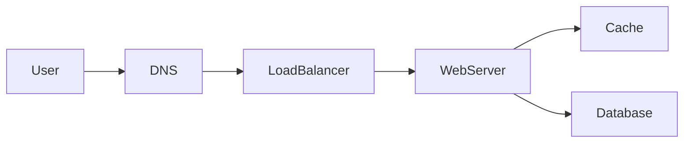

# Writing, diagram, and content standards

Status: Writing · Version 1.0 · Author: Abdul Hussain (Enterprise Architect)

## Writing standards

Every chapter uses this heading order. Do not skip a section. If a section is short, keep it short — do not delete the heading.

1. **Chapter Title** (`# ...`) — no "Chapter N" prefix; numbering comes from the filename and `book.yaml`.
2. **Learning Objectives** — 3–5 bullets the reader can check after the chapter.
3. **Quote** — one blockquote. Original or clearly attributed. Not filler Latin.
4. **Introduction** — why this topic shows up in interviews and in production.
5. **Core Concepts** — first-principles explanation. Define terms before using them.
6. **Architecture Diagram** — at least one Mermaid block or a Draw.io embed. Caption it as *Figure C.N*.
7. **Real-world Example** — a concrete system (can be a composite, not a vendor case study copied from a blog).
8. **Enterprise Insight** — how this plays in a large organization: governance, cost, teams, legacy.
9. **Interviewer's Mind** — what the interviewer is listening for, and what a weak answer sounds like.
10. **AI Perspective** — where models, RAG, inference, or AIOps change the design — or a sentence that they do not.
11. **Common Mistakes**
12. **Best Practices**
13. **Summary** — a short recap in prose.
14. **Key Takeaways** — bullets.
15. **Interview Questions** — questions the reader should be able to answer out loud.
16. **Further Reading** — pointers only. No pasted excerpts.

`tools/build.py lint` fails if a chapter is missing any of these headings.

## Diagram standards

### Mermaid (default)

Use Mermaid for request paths, sequences, state, and simple ER.

Rules:

- Keep labels short; Kindle shrinks diagrams.
- Do not encode meaning only in color.
- Caption every figure.
- Optional: save a copy as `diagrams/chapterNN/name.mmd`.

### Draw.io (complex architectures)

Use Draw.io when the picture has layers, many stores, or a multi-region story (for example a Netflix-like streaming plane or an Uber-like dispatch plane).

- Source: `diagrams/chapterNN/<name>.drawio`
- Publishable SVG: `diagrams/chapterNN/<name>.drawio.svg`
- Page: landscape, content within ~960×540
- Embed: ``
- Match the book palette: clients blue, edge gold, app green, data purple, async rose (see chapter 09 template).

Save all diagram files as **UTF-8**.

## Content rules

1. Write from first principles in our own words.
2. Use public resources only as references for *concepts*. Never copy their wording, figures, or question banks.
3. Keep explanations practical and tied to a trade-off (what you gain, what you give up).
4. Put the enterprise-architect voice in **Enterprise Insight** every chapter.
5. Include AI and cloud-native notes only when they change a box, a SLO, or an operating model.
6. Status on each chapter front matter: `draft` | `review` | `done`.
