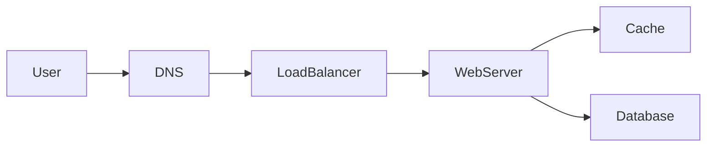

# Welcome

## Learning Objectives

- Explain what a system design interview is actually scoring.
- Distinguish a repeatable method from a memorized product catalog.
- Recognize the chapter shape used for the rest of this book.
- Name the five layers that belong on a first-pass architecture sketch.

## Quote

> A design interview is a short, public architecture review. The marker is not there to decorate the board. It is there to make your trade-offs visible.

## Introduction

If you have built production systems, you already know more than the interview requires. The failure mode is not ignorance. It is **unstructured competence**: jumping to Kafka, then to Kubernetes, then to a multi-region story before anyone agreed what "the system" is.

This book treats the interview as a design review with a clock. You will practice a loop: bound the problem, make a few honest numbers, draw one picture, go deep where it hurts, and close. Later chapters fill the loop with requirements, capacity, scale, and availability. Interview problems at the end are practice, not a zoo of "correct" diagrams.

## Core Concepts

Three ideas sit under every chapter.

**Method over inventory.** Interviewers can buy cloud products. They cannot buy your judgment. Judgment shows up as a sequence: what you asked, what you assumed, what you drew, and what you would revisit if a constraint moved.

**One picture, two paths.** A useful board has a read path and a write path. If you cannot trace a user click from the edge to durable storage and back, you do not yet have a design. You have a collage.

**Trade-offs are the payload.** Every box you add costs money, latency, or operational load. Saying "we will add a cache" is unfinished. Saying "we cache the mapping because the working set is small and the read/write ratio is extreme; we accept stale redirects for a few seconds" is a design.

## Architecture Diagram

A first-pass sketch almost always has the same five layers. Rename the boxes. Do not skip a layer without a sentence.

*Figure 1.1 — Default request path. DNS and the load balancer are the edge; the web server is application logic; cache and database are data. Asynchronous work is missing on purpose: add it when the user should not wait.*

## Real-world Example

You are asked to "design a document store for a company of 40,000 people." A weak start lists S3, Elasticsearch, and a service mesh. A strong start asks: are we storing contracts with retention rules, or wiki pages with live collaboration? One of those is an object plus metadata and a search projection. The other is a consistency problem with presence and conflict. Same English word, different diagrams. The welcome chapter's job is to make you pause long enough to hear the difference.

## Enterprise Insight

In an enterprise, the interview is a proxy for architecture reviews you will attend weekly: security wants a control, finance wants a cost line, a platform team wants you on the blessed load balancer, and a product owner wants the feature Friday. Your value is not drawing more boxes. It is naming which constraint is allowed to win today, and which decision is reversible next quarter.

## Interviewer's Mind

The interviewer is asking: *Can I put this person in a room with a messy problem and a senior stakeholder without being embarrassed?* They listen for structure, not for the newest product name. If you skip requirements, they will drag you back. If you never draw, they will not trust the words. If you never say what you are giving up, they will assume you have not noticed.

## AI Perspective

Generative tools can dump a plausible architecture in seconds. That is a hazard in the room. Interviewers are scoring *your* sequence of questions and trade-offs. Use models after the interview to critique your own diagram. In production, AI features are just more services: they add GPU capacity, prompt/versioning, data-retention questions, and a latency budget that does not belong on the user's click path unless the product is the model.

## Common Mistakes

- Starting with technology names before a problem sentence.
- Drawing ten products and no request path.
- Treating the interview as a quiz on one famous book or course.
- Ignoring the clock, then rushing the only part the interviewer cared about.

## Best Practices

- Restate the problem and the non-goals out loud.
- Keep a parking lot for "if we have time."
- Draw early; talk while you draw.
- When you add a component, say the number or NFR that justified it.

## Summary

This book is a playbook, not an encyclopedia. You will see the same chapter shape until it is muscle memory. The default diagram is five boxes and two data stores. Everything else is a variation you must justify.

## Key Takeaways

- Interviews score structured judgment under time.
- Method first, inventory second.
- Always show a read path and a write path.
- Name the trade-off when you add a box.

## Interview Questions

- What is the interviewer actually hiring for in a system design round?
- What belongs on a first-pass diagram before any vendor name?
- How do you recover if you realize ten minutes in that you designed the wrong product?

## Further Reading

- This book's [STANDARDS.md](../STANDARDS.md) for chapter and diagram rules.
- Appendix A for the board cheat sheet.
- Your last production design review notes: rewrite them as a 45-minute board session.
