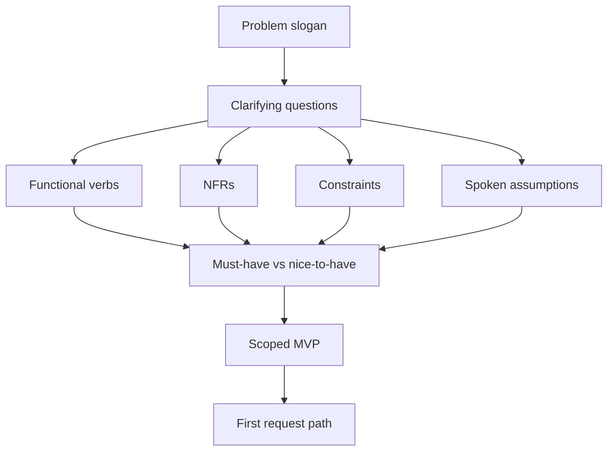
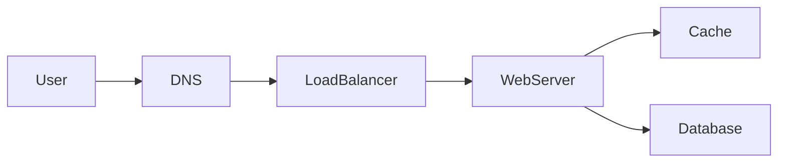

# Understanding requirements

## Learning Objectives

- Separate functional requirements from non-functional ones that change the diagram.
- Capture constraints, assumptions, and scope before any boxes.
- Ask clarifying questions that unlock architecture, not trivia.
- Prioritize must-have versus nice-to-have so a 45-minute design stays honest.
- Walk a real prompt ("design a WhatsApp-like messenger") the way an architect would, before drawing.

## Quote

> Architects do not start with boxes. They start with verbs, limits, and the questions that make a slogan into a system.

## Introduction

Every system design interview starts here, whether the interviewer says so or not. "Design WhatsApp." "Design a news feed." "Design a payments API." Those are slogans. If you reach for a load balancer in the first sixty seconds, you are guessing.

This chapter is how architects think **before** they design: functional behavior, non-functional pressure, constraints you cannot negotiate, assumptions you must say out loud, clarifying questions, a scoped MVP, and an explicit parking lot. Capacity numbers come in Chapter 3. The picture comes after that. Requirements are the filter that decides what the picture is allowed to contain.

## Core Concepts

### Functional requirements

Functional requirements are user-visible verbs. Send a message. Receive it while offline. Create a group. They belong in language a product owner would recognize. They are not "we will use WebSockets."

Write them as a short list. If you cannot demo the verb, it is not functional yet.

### Non-functional requirements

Non-functional requirements (NFRs) are how the verbs must feel: latency, availability, consistency, durability, security, cost, compliance, operability. You cannot maximize all of them. Circle the two that would **redraw the diagram** if they moved.

"End-to-end encryption" is an NFR that can split your design (where keys live, what the server is allowed to see, how search works). "Pretty bubbles" is not.

### Constraints

Constraints are facts you are not allowed to wish away: existing identity provider, data residency, a mobile-only client, a peak event next month, a team of four. In interviews they often arrive as "you cannot use a managed queue" or "assume we already have object storage." Write them on the board. Fighting a stated constraint to look clever is a fail.

### Assumptions

Assumptions are requirements you invented because nobody knew. They are valid only if you **speak them**. "I will assume 50 million daily active users and one-to-one chat first; tell me if that is wrong." Silent assumptions become silent failures when the interviewer meant 50 thousand internal users and groups of 5,000.

### Clarifying questions

Good questions change a box, an SLO, or the data model. Bad questions collect trivia. Prefer:

- Who is the user, and what is the one verb they must complete?
- What are the inputs and outputs of that verb?
- How much data do we store, and for how long?
- Rough requests per second, and the **read/write ratio**?
- One-to-one only, or groups? How large?
- Online-only, or store-and-forward?
- Media? Voice or video in this round?
- Read receipts, typing indicators — MVP or later?
- Encryption: transport only, or end-to-end?
- Daily active users, peak vs average, read/write shape?
- How long do we retain messages? Who may search them?
- Which region(s)? Any regulation on where bytes sit?

Inputs, stored volume, RPS, and read/write ratio are not trivia. They are the first four cells of the Chapter 3 table. Ask them even when the prompt is a brand name.

Stop when the next question would not change the first diagram.

### Scope definition

Scope is an explicit in-list and out-list. The out-list is a product, not a confession. "Custom themes, multi-device sync, and calls are parked." If the interviewer pulls one back, they just told you the deep dive.

### Prioritization (must have vs nice to have)

Must-have is what you will design in this session. Nice-to-have is named so the interviewer knows you heard it. A useful split for a messenger MVP: deliver 1:1 text with offline inbox and basic presence. Nice-to-have: large groups, receipts, reactions, calls. Must-haves get APIs and storage. Nice-to-haves get a one-line "how we would extend."

## Architecture Diagram

Requirements work produces a **decision tree**, not a data-center drawing. Only then does the default request path appear.

*Figure 2.1 — Architects think left to right. Boxes come after Scope.*

Once scope exists, the first path is still the simple one. You have not earned extra stores yet.

*Figure 2.2 — After scope, a default path. Attach NFRs to hops: encryption at the client, latency at the edge, durability at the database.*

## Real-world Example

**Prompt:** "Design WhatsApp."

A weak candidate draws WebSockets, Kafka, Cassandra, and a TURN server in two minutes. A strong candidate does this instead.

**Clarifying questions (ask, then write the answers you agreed):**

- Should it support one-to-one chat only?
- Do we need group chats? How large is a group in this round?
- Voice or video calls in this 45 minutes?
- Read receipts? Typing indicators?
- End-to-end encryption — required for MVP?
- Expected daily active users? Peak concurrent connections?
- Message retention period? Can the user delete everywhere?
- Multi-device? Last-seen privacy?

**A defensible MVP for a 45-minute round:**

| Must have | Nice to have (parked) |
| --- | --- |
| 1:1 text, online and offline | Groups above a small size |
| Delivery to other devices of the same user *or* a stated single-device assumption | Voice/video calls |
| Basic presence (online / last seen as a coarse flag) | Read receipts, reactions |
| Transport encryption; E2E if they said it is must-have | Global search of all history |
| Retention: 30 days on server *or* "until user deletes" — pick one and say it | Channels / status / payments |

**Functional list:** send; receive while the other party is offline; list recent conversations; (optional) notify.

**NFRs that change the diagram:** delivery latency for online peers; durability of undelivered messages; if E2E is in, the server cannot be the search index for message bodies.

**Constraints:** mobile clients, flaky networks, a push-notification dependency you do not own.

**Assumptions to say:** "I will assume 100 million DAU unless you want internal-only scale. I will assume 1:1 first, groups as an extension of the same fan-out path."

Only now do you sketch connections, a message store keyed by conversation, and a fan-out path. The boxes were earned.

This is how architects think before they design: the product is a set of verbs under limits, not a brand name.

## Enterprise Insight

In an enterprise the same prompt is often "design our internal messenger" and the hidden requirements live in other documents: records-retention holds, eDiscovery, data residency, DLP, SSO, and "must run on the corporate device fleet." Those are constraints, not features. A consumer-style E2E design may be **illegal** for a bank that must retrieve messages under discovery. Ask who the legal audience is. Interviewers for enterprise roles listen for that question. Interviewers for consumer roles listen for privacy. Same slogan, opposite NFRs.

Prioritization in a company is political: security wants E2E, compliance wants search, product wants receipts. Your job in the room is to name the conflict, not to pretend it is not there.

## Interviewer's Mind

They are scoring whether you **negotiate the problem**. A candidate who lists twenty features is scared of missing points. A candidate who asks about 1:1 versus groups and then parks calls is running the room.

Weak: jumping to CAP theorem or a vendor list before any user story.

Strong: "Which of delivery latency or on-device encryption should win if they conflict?" and "Must-have is 1:1 text with offline inbox."

If they refuse to answer a clarifying question, they want you to assume — so assume **out loud**.

## AI Perspective

If the messenger includes "smart replies," moderation, or translation, those are extra verbs with extra NFRs: a model on the hot path vs async, training-data residency, and whether E2E even allows a server-side model to see plaintext. Default: keep AI **off** the send path; run moderation on a copy only if legal and product allow it; fail open so chat still works when the model is down. Do not bolt a chatbot onto WhatsApp in minute two to sound current.

## Common Mistakes

- Drawing boxes before a single clarifying question.
- Collecting NFRs like trophies ("highly available, strongly consistent, globally encrypted, cheap").
- Treating the brand name as the spec.
- Never writing non-goals.
- Designing calls, payments, and channels because the real app has them.

## Best Practices

- Questions first, then a two-column must/nice table.
- 5–8 functional bullets, two circled NFRs, spoken assumptions.
- Repeat the interviewer's answers in your own words.
- Keep the parking lot visible.
- Revisit requirements after estimates (Chapter 3): numbers kill pretty NFRs.

## Summary

Requirements turn a slogan into a system. Functional verbs say what. NFRs say what would change the picture. Constraints are non-negotiable. Assumptions are spoken. Clarifying questions are how architects think. Scope and prioritization are how you finish on time. For "design WhatsApp," the win is the questions and the MVP table, not a TURN server in minute one.

## Key Takeaways

- Interviews start with requirements, even when the prompt is a product name.
- Must-have versus nice-to-have is a design artifact.
- Clarifying questions should change boxes, SLOs, or data models.
- Enterprise and consumer messengers can be opposite designs under the same slogan.
- Do not draw until scope exists.

## Interview Questions

- Walk through the first five questions you would ask for "design WhatsApp."
- Give an NFR that would split one chat service into two.
- How do you handle an interviewer who keeps adding features at minute 30?
- When is end-to-end encryption a must-have versus a parked item?
- What is the difference between a constraint and an assumption on the board?

## Further Reading

- Chapter 3, where this MVP becomes users, QPS, storage, bandwidth, and memory.
- Chapter 10, where two NFRs become an explicit trade-off sentence.
- Appendix A, steps 1–2.
- [How to approach a system design interview](https://github.com/donnemartin/system-design-primer#how-to-approach-a-system-design-interview-question) — use as a question checklist, not as wording to recite.
- Appendix A, steps 1–2.
- Your organization's architecture intake form: strip it to what still fits in ten minutes.
