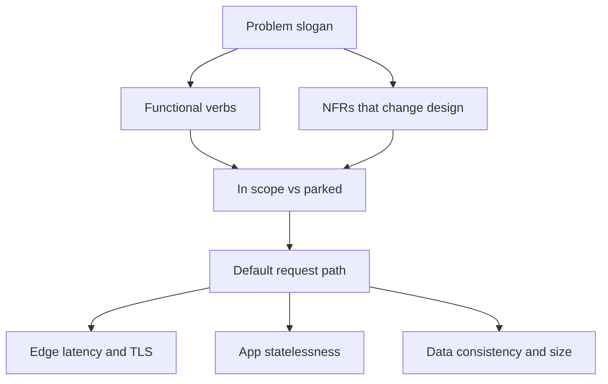

# Understanding requirements

## Learning Objectives

- Separate functional behavior from non-functional constraints that change the diagram.
- Bound scope so the interview stays a design review, not a product launch.
- Ask clarifying questions that unlock architecture, not trivia.
- Pick the two NFRs you will defend for the rest of the session.

## Quote

> If a requirement would not change a box, a database, or an SLO, write it down later. The board is expensive real estate.

## Introduction

Most bad designs in interviews are not technically wrong. They are **unbounded**. "Design Twitter" is not a problem. It is a career. Your first job is to turn a slogan into a system: who uses it, what they do, how fresh data must be, how wrong it is allowed to be, and what you will not build in forty-five minutes.

This chapter is the requirements move in the playbook. Skip it, and capacity numbers later are theater.

## Core Concepts

**Functional requirements** are user-visible verbs. Create a short link. Redirect. Show a feed. They belong in language the product owner would recognize.

**Non-functional requirements (NFRs)** are how the verbs must feel: latency, availability, consistency, durability, cost, compliance, operability. You cannot optimize all of them. Choose the two that would redraw the picture if they moved.

**Scope** is an explicit list of non-goals. Custom vanity domains, SSO, a marketing analytics suite — park them. If the interviewer pulls one back in, that is a gift: they just told you where to go deep.

**Assumptions** are requirements you invented because nobody knew. Say them. "I will assume 100 million new links per month; tell me if that is off by an order of magnitude." Silent assumptions become silent failures.

## Architecture Diagram

Requirements work is not a box diagram yet. It is a filter on the default path: which NFRs attach to which hop.

*Figure 2.1 — Requirements as a filter. If an NFR does not attach to edge, app, or data, it is not yet a design input.*

## Real-world Example

"Design notifications for our bank." Functional: notify the account holder that a payment left. NFRs that change the design: **exactly-once customer-visible alerts are wrong** (duplicates are better than silence for fraud), but **never leak the amount to the wrong device**. That pair pushes you toward durable delivery plus identity binding, and away from a best-effort firehose. Cost and "pretty templates" can wait. The interviewer wanted to see you pick the NFR that would get the bank fined.

## Enterprise Insight

Enterprises hide requirements in other documents: control frameworks, data-residency clauses, named-platform standards, vendor lock-in fears. In a review you translate those into design. "Must stay in-region" is not a slogan; it is a constraint on the data stores and the identity plane. "Must use the enterprise API gateway" may save you from inventing an edge. Ask. Fighting the platform in an interview without being asked is a smell; so is ignoring it when they said it exists.

## Interviewer's Mind

They want to hear you **negotiate**. A candidate who lists twenty features is scared of missing points. A candidate who says "I will do create, redirect, and basic click counts; QR codes if we have time" is running the room. Weak signal: jumping to CAP theorem before any user story. Strong signal: "Which of latency or consistency should win on the redirect path?"

## AI Perspective

If the product includes a model (summarize the document, rank the feed, moderate the chat), treat the model as a dependency with its own SLO, cost per request, and failure mode. Do not bury inference on the hot path unless the feature *is* the inference. Retrieval-augmented features add a search index that is a **projection**, not the source of truth. Ask where training data is allowed to live; that is an NFR, not an implementation detail.

## Common Mistakes

- Collecting NFRs like trophies ("highly available, strongly consistent, globally distributed, cheap").
- Never writing non-goals.
- Treating "scale" as a requirement without a number.
- Designing for a mobile offline client that nobody mentioned.

## Best Practices

- Write 5–8 functional bullets, then circle two NFRs.
- Repeat the interviewer's constraints in your own words.
- Keep a parking lot visible on the board.
- Revisit requirements after estimates: numbers often kill a pretty NFR.

## Summary

Requirements turn a slogan into a system. Functional verbs say what. NFRs say what would change the picture. Scope says what you will not pretend to finish. Assumptions are spoken or they are landmines.

## Key Takeaways

- Unbounded problems produce decorative diagrams.
- Two NFRs beat ten adjectives.
- Non-goals are part of the design.
- Say assumptions so they can be corrected.

## Interview Questions

- Give an example of an NFR that would split one service into two.
- How do you handle an interviewer who keeps adding features at minute 30?
- What is the difference between a wish and a requirement on the board?

## Further Reading

- Chapter 3, where requirements become numbers.
- Appendix A, steps 1–2.
- Your organization's intake template for architecture reviews: strip it down to what still fits in ten minutes.
