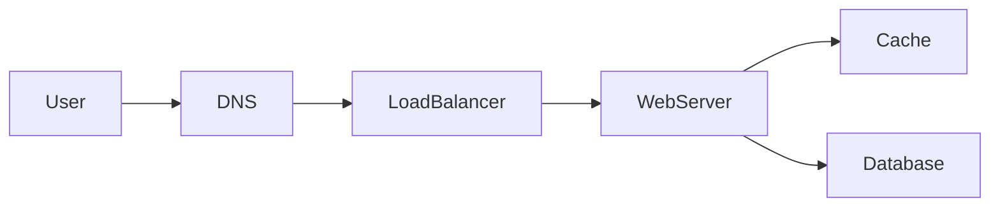

# Capacity estimation

## Learning Objectives

- Fill a small table: QPS, payload, stored bytes, read/write ratio, working set.
- Turn an estimate into a component justification (cache, queue, partition).
- Keep arithmetic visible and order-of-magnitude honest.
- Know when a number is good enough to stop.

## Quote

> A cache is a claim about volume. If the volume is not on the board, the cache is a superstition.

## Introduction

Back-of-the-envelope math is not a performance exam. It is how you stop guessing. Interviewers watch whether you can connect "100 million users" to "this working set fits in memory" or "a single primary will not take the write QPS." This chapter is that conversion.

You will be wrong by 2–3×. That is fine. Being wrong by 100× because you never multiplied is not.

## Core Concepts

Fill this table every time, even if some cells are "unknown, assume X":

| Quantity | Why it matters |
| --- | --- |
| Peak and average QPS | Size of stateless compute and connection load |
| Payload size | Bandwidth and serialization cost |
| Read/write ratio | Cache, CQRS, or specialized stores |
| Stored bytes / year | Disk, object storage, retention |
| Working set | What must be fast versus cold |
| Fan-out | Whether a write explodes into N reads |

Rules of thumb you may use, as long as you show the work: ~10^5 seconds per day; a short URL and metadata are hundreds of bytes, not megabytes; indexes are not free; three replicas are 3× storage.

**Stop condition.** Once a number has justified a component or killed one, move on. Do not spend twelve minutes converting units.

## Architecture Diagram

Estimates attach to hops on the default path.

*Figure 3.1 — Same path as Chapter 1. Ask: which hop is dominated by QPS, which by bytes, which by working-set size?*

Example conversion:

- High QPS, tiny objects, tiny working set → cache in front of the database on the read path.
- Bursty writes, slow consumers → queue; the user does not wait for analytics.
- Working set larger than one machine's RAM and QPS beyond one primary → partition on a key you can name.

## Real-world Example

URL mapping: 100 million new links per month is a few tens per second on average, higher at peak. Storage for mappings is modest. Click logs at 100:1 read/write on redirects are **not** modest if you store them on the redirect path. The estimate told you to **split redirect from analytics** before you drew Kafka because it was fashionable.

## Enterprise Insight

Enterprises already have capacity numbers: last year's QPS on the gateway, the size of the warehouse, the backup window. In a real review you start from measured data. In an interview you invent a plausible baseline and offer it for correction. Either way, **cost is an NFR hiding inside capacity**. A design that 10×s object-storage PUT volume will get killed in architecture review even if it "works." Mention the cost shape: per-request, per-GB, per-partition.

## Interviewer's Mind

They are not checking your mental arithmetic against a key. They are checking whether you **use** the number. Weak: "assume high QPS" then draw the same diagram you always draw. Strong: "writes are ~50/s, reads ~5k/s, so I will not shard yet; I will cache." If they give you a number, treat it as sacred until they change it.

## AI Perspective

Inference changes the table. Tokens in and out have a cost and a latency that dwarf a cache GET. Batch embeddings off the hot path. If you add a ranking model to a feed, estimate whether it must run synchronously (user waiting) or can refresh a stored rank. GPU capacity is a different scaling curve than stateless web tiers: you scale it with queues and batching, not with "add another pod" folklore alone.

## Common Mistakes

- Precision theater (17,342.7 QPS) with no component decision.
- Forgetting replicas, indexes, and logs in storage.
- Using daily actives as if they were concurrent.
- Putting analytics volume on the user-facing latency budget.

## Best Practices

- Write units. "100 million" without per-day or per-second is a poster.
- Convert to per-second once, then round.
- Announce the decision the number supports.
- Invite the interviewer to correct the baseline.

## Summary

Capacity estimation is a small table that earns the next box. Show the work, round aggressively, and stop when the architecture has a reason.

## Key Takeaways

- QPS, bytes, ratio, working set: four numbers do most of the work.
- Components must be justified by volume or they are decoration.
- Being roughly right beats being silently wrong.
- Split hot paths from bulk paths when the bytes disagree.

## Interview Questions

- How would you estimate storage for five years of click events versus five years of URL mappings?
- What number would make you introduce partitioning on a first-pass design?
- Why is "highly scalable" not an estimate?

## Further Reading

- Chapter 4, where these numbers become scale-out stories.
- Appendix A, step 3.
- Internal dashboards from a system you already run: practice reconstructing the table from graphs without looking at the wiki.
