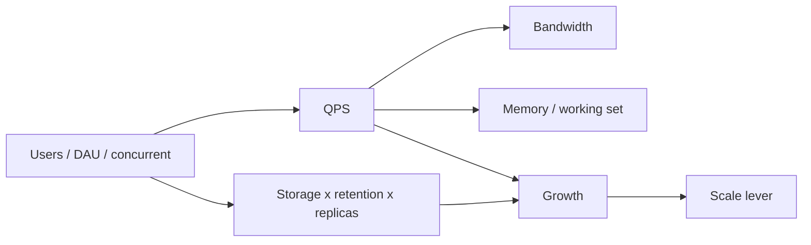
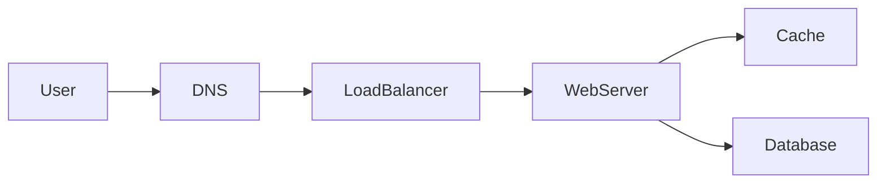

# Capacity estimation

## Learning Objectives

- Estimate from a scoped MVP: users, QPS, storage, bandwidth, memory, and growth.
- Convert units with powers of two and attach latency orders of magnitude to hops.
- Show arithmetic that is honest to an order of magnitude.
- Attach each number to a hop or a component.
- Know when a number is good enough to stop.

## Quote

> A cache is a claim about volume. If the volume is not on the board, the cache is a superstition.

## Introduction

Back-of-the-envelope math is not a performance exam. It is how you stop guessing after Chapter 2. Interviewers watch whether "100 million users" becomes QPS, then bytes on the wire, then RAM for the working set, then a growth line that would force a partition next year.

You will be wrong by 2–3×. That is fine. Being wrong by 100× because you never multiplied is not. This chapter is the conversion table: **users, QPS, storage, bandwidth, memory, growth**.

## Core Concepts

### Users

Start from the assumption you spoke in Chapter 2. Daily active users (DAU) are not concurrent users. Concurrent is closer to "how many hold a connection or hit an API in the same second." A rough interview move: peak concurrent ≈ a small fraction of DAU (you might start at 1–10% and ask them to correct you). Write both numbers.

### QPS

Queries per second (or messages per second) come from concurrent users × actions per user per second, or from DAU × actions per day / 86,400, then a peak factor (often 2–5× average). Split **read QPS and write QPS**. A messenger is write-heavy on send and read-heavy on sync-after-offline. A URL shortener is the opposite.

### Storage

Storage is records × size × retention × replicas. Message bodies, attachments, and indexes are different lines. Five years of click logs is not the same as five years of 200-byte mappings. Say replication factor (3× is a common first guess) so you do not "fit on one disk" by forgetting copies.

### Bandwidth

Bandwidth is QPS × payload size, inbound and outbound. Fan-out multiplies outbound: one send to a group of 50 is 50 deliveries. Video is a different era of numbers; if calls are parked, do not mix them into text bandwidth.

### Memory

Memory is for **working sets** you want hot: open sessions, recent conversations, cache keys. RAM is not "the database." Estimate: active sessions × session size, plus cache working set. If the hot mapping table is 40 GB and a box has 64 GB, a cache tier is plausible. If it is 40 TB, you are telling a partition story, not a Redis story.

### Growth projections

Ask "same design at 2× and 10× in 18 months?" Growth is users, QPS, and stored bytes — they do not grow at the same rate. Storage often grows even if DAU is flat (retention). QPS grows with engagement. Say which lever you would pull first at 10× (Chapter 4) instead of redrawing everything now.

### Powers of two (unit conversion)

Keep a tiny conversion table in your head so storage estimates do not stall:

| Approx | Meaning on the board |
| --- | --- |
| 2^10 | thousand, ~1 KB |
| 2^20 | million, ~1 MB |
| 2^30 | billion, ~1 GB |
| 2^40 | trillion, ~1 TB |

A 200-byte message × 10^8 users is not "a lot of data" until you multiply by messages per day, retention, and replicas. Powers of two turn that multiplication into GB/TB without a calculator.

### Latency orders of magnitude

Capacity is not only bytes. It is whether an operation fits the **time** budget (Chapter 7). Orders of magnitude you should be able to say without precision theater:

- In-process / RAM: tens to hundreds of nanoseconds.
- Same-datacenter round trip: on the order of half a millisecond.
- SSD random read: hundreds of microseconds.
- Disk seek: around ten milliseconds.
- Continent-to-continent: around a hundred milliseconds or more.

Handy consequences: you get a couple of thousand round trips per second inside one DC, and only a handful of transatlantic round trips per second. Do not put N disk seeks on a redirect path. Do not pretend a cross-region consensus round will meet a 50 ms p99.

**Stop condition.** Once a number has justified a component or killed one, move on.

## Architecture Diagram

Estimates attach to hops.

*Figure 3.1 — Six quantities, one lever. Do not skip from Users to Kafka.*

*Figure 3.2 — Where the numbers land: connections and QPS on the web tier; working set on the cache; retained bytes on the database and object store.*

## Real-world Example

Take the WhatsApp-like MVP from Chapter 2, with a spoken assumption of **100 million DAU**, 1:1 text only, 40 messages per user per day, 200-byte payload, 30-day server retention of undelivered-plus-recent, attachments parked.

- **Users:** 100M DAU. Peak concurrent connections: assume 5M (5%) unless they correct you.
- **QPS:** 100M × 40 / 86,400 ≈ 46k messages/s average. Peak ×3 ≈ 140k/s. That is send+receive; count both if each is an API.
- **Storage:** 100M × 40 × 200 B × 30 days ≈ 2.4 TB/month of raw text before indexes and replicas. ×3 replicas ≈ 7 TB class — uncomfortable on one primary, comfortable as a cluster. Attachments would dominate if you un-parked them.
- **Bandwidth:** 140k/s × 200 B ≈ 28 MB/s payload at peak for one hop — small for text, irrelevant compared with fan-out or media.
- **Memory:** 5M connections × 2 KB connection state ≈ 10 GB just for sockets/session — that already suggests more than one connection box. Cache of recent threads is a separate working-set line.
- **Growth:** 2× DAU in a year doubles QPS and connection RAM; storage also grows with retention policy. At 10× you partition by conversation ID (Chapter 4), you do not add a new product family in a panic.

A different assumption — **50,000 enterprise users** — yields tens of QPS. Then a single primary is honest, and talking about regional Kafka is theater. The method is the same; the numbers decide the boxes.

## Enterprise Insight

Enterprises already have capacity: last year's gateway QPS, warehouse size, backup window. In a real review you start from measured data. In an interview you invent a baseline and offer it for correction. Either way, **cost is an NFR hiding inside capacity**. Connection-heavy designs (long-lived sockets) cost RAM and file descriptors, not only CPU. Retention policies from legal can dwarf engineering's "keep messages forever" instinct — 7-year mail archives are a storage product, not a chat feature.

## Interviewer's Mind

They are not checking your mental arithmetic against an answer key. They are checking whether you **use** the number. Weak: "assume high QPS" then draw the same diagram you always draw. Strong: "writes are tens of thousands per second, payloads are tiny, working set of connections is the first bottleneck — I will scale the connection layer before I shard the message store."

If they give you a number, treat it as sacred until they change it.

## AI Perspective

Inference changes the table. Tokens in and out have cost and latency that dwarf a 200-byte message. Batch embeddings off the hot path. If you add on-device or server-side smart replies, estimate QPS of inference separately from message QPS; GPU memory is a different line from connection RAM. Do not fold "AI" into the 28 MB/s text bandwidth and call it done.

## Common Mistakes

- Treating DAU as concurrent.
- Precision theater (17,342.7 QPS) with no component decision.
- Forgetting replicas, indexes, and logs in storage.
- Mixing parked video calls into the text bandwidth line.
- Skipping memory for connection-oriented systems.

## Best Practices

- Fill the six-line table: users, QPS, storage, bandwidth, memory, growth.
- Write units. Convert to per-second once, then round.
- Split read vs write, payload vs attachment.
- Announce the decision the number supports.
- Invite the interviewer to correct the baseline.

## Summary

Capacity estimation is a small table that earns the next box. Users become QPS; QPS and payload become bandwidth; retention becomes storage; working set becomes memory; time becomes growth. Show the work, round aggressively, and stop when the architecture has a reason.

## Key Takeaways

- Six quantities: users, QPS, storage, bandwidth, memory, growth.
- DAU is not concurrency.
- Components must be justified by volume or they are decoration.
- Enterprise scale and consumer scale use the same table and different boxes.
- Being roughly right beats being silently wrong.

## Interview Questions

- Convert 100 million DAU and 40 messages/user/day into average and peak QPS.
- How would you estimate storage for 30-day text versus 5-year attachments?
- Why might connection memory saturate before database disk?
- What growth line would you watch if DAU is flat but legal extends retention?
- When do you stop estimating in a 45-minute interview?

## Further Reading

- Chapter 4, where these numbers become scale-out stories.
- Chapter 7, where QPS meets latency budgets.
- Appendix A, step 3, plus the powers-of-two and latency-order notes.
- Public latency-order references (widely taught large-scale systems talks): use orders of magnitude; do not paste tables.
