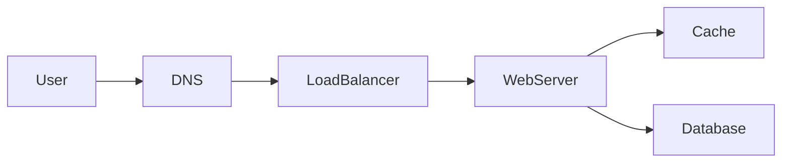

# Scalability

## Learning Objectives

- Distinguish vertical scale, horizontal scale, and work you should not do on the hot path.
- Choose partition keys and say what happens when they are hot.
- Scale reads, writes, and storage as separate problems.
- Describe what breaks at 10× without redrawing the whole board.

## Quote

> Scale is not a property of Kubernetes. It is a property of the bottleneck you have not named yet.

## Introduction

"Make it scalable" is how slogans sneak back in after you just finished requirements. Scalability means: when load grows, which resource saturates first, and what lever do you pull? Compute? Disk? A single lock? A single customer ID? This chapter is that lever, in first principles.

## Core Concepts

**Vertical scaling** is a bigger machine. It is honest, fast to ship, and finite. Mention it. Senior people who skip it look like they have never been on call at 2 a.m. with a budget freeze.

**Horizontal scaling** is more machines doing the same kind of work. It requires **stateless app tiers** and **partitioned data**. If session state lives in the app process, you do not have horizontal scale. You have sticky routing and a future incident.

**Partitioning** splits data by a key. The key must spread load. User ID often works; a boolean "is_active" never does. Hot keys (a celebrity, a flash sale SKU) need a special story: cache, split, or isolate.

**Scale the right axis.** Reads like caches and replicas. Writes like queues, log-structured stores, and careful primary design. Storage like object stores and tiering. Mixing those sentences is how diagrams become mush.

## Architecture Diagram

*Figure 4.1 — Where scale levers sit: DNS and the load balancer spread connections; web servers scale out if stateless; cache absorbs repeated reads; the database scales only after you name a partition key or a replica role.*

Add a second web server only after you say "stateless." Add a second database only after you say "replica for reads" or "shard by user_id."

## Real-world Example

A checkout service dies every holiday because inventory for one SKU is a single row. More pods do nothing; they serialize on the same row. The scale fix is not "Kubernetes HPA." It is inventory as a reservation log, or sharded stock buckets, or a queue in front of a single serializer with honest backpressure. The interview version: name the hot key before you draw a cluster.

## Enterprise Insight

Platform teams will offer you autoscaling groups and managed databases. Take them. Your job is still the **data plane story**: what is replicated, what is sharded, what is a cache that can vanish. Enterprises also scale *organizations*. A service that needs a cross-team change to add a partition is not horizontally scalable in practice. Prefer designs a single team can operate at 10×.

## Interviewer's Mind

They wait for the sentence: "At 10×, this primary becomes the bottleneck; I would partition by X; the risk is Y." Candidates who chant "microservices" without a bottleneck get a follow-up that feels like an ambush. It is not an ambush. You never named the resource.

## AI Perspective

Model serving scales with batch size, GPU memory, and queue depth, not with the same curve as a JSON API. Feature stores and embedding indexes are additional data systems with their own partition keys. If AI ranking is on the read path, 10× users may 10× GPU cost before they 10× your database. Call that out; it is a more mature answer than "we will use a bigger model."

## Common Mistakes

- Equating "more services" with "more scale."
- Sharding before a single primary is actually full.
- Ignoring hot keys.
- Scaling the app tier while the database connection pool is the ceiling.

## Best Practices

- Say "stateless" before you duplicate app boxes.
- Name the partition key and one hot-key mitigation.
- Separate read scale from write scale on the board.
- Describe the 10× story in two sentences at the end of the design.

## Summary

Scalability is the named bottleneck and the lever you will pull. Stateless compute, careful keys, and different tactics for reads versus writes beat a generic cluster drawing.

## Key Takeaways

- Vertical scale is a valid first lever.
- Horizontal scale needs stateless apps and a partition story.
- Hot keys are a scale problem, not an edge case.
- 10× should change one part of the diagram, not all of it.

## Interview Questions

- When would you refuse to shard in the first 45 minutes?
- How do you scale reads without scaling writes?
- What makes a bad partition key?

## Further Reading

- Chapter 5, availability, which is often in tension with scale-out writes.
- Chapter 12, storage, for replica and shard mechanics.
- Chapter 6, reliability, when scale-out creates more failure domains.
- A postmortem from your own hot-key incident, rewritten as a board story.
