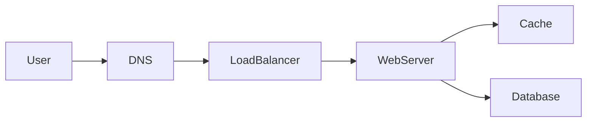
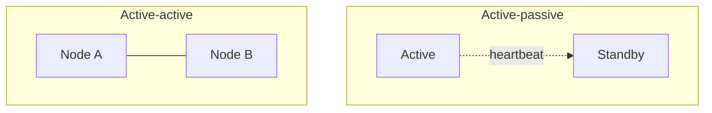

# Availability

## Learning Objectives

- Define availability as an SLO, not as "the site is up."
- Translate nines into downtime and combine components in series versus in parallel.
- Contrast active-passive and active-active failover.
- Place redundancy on the path: instances, zones, and (when asked) regions.
- Pair retries with idempotency and timeouts.
- Explain when a degraded mode is better than a full outage.

## Quote

> Three nines is a budget. You spend it on change, on dependencies, and on the one database you made a single point of failure.

## Introduction

Availability is the share of time the user can complete the verb you promised. It is not "we run Kubernetes." It is redundancy, failure detection, and what the product does when a dependency is sick. Interviews use it to see whether you design for **failure as a normal input**.

## Core Concepts

**SLO.** Pick a number you can defend (for example, 99.9% for an internal tool, tighter for checkout). The remaining fraction is your error budget for deploys and incidents.

**Redundancy.** Two app instances behind a load balancer survive one crash. Two zones survive one data center. Two regions survive a disaster and create a **data** problem: what is replicated, how far behind, who is primary.

**Timeouts, retries, backoff.** A retry without a timeout is a herd. A retry without idempotency is a double charge. Draw them on the client-to-edge hop and on the app-to-database hop as policies, not as hope.

**Degradation.** If the recommendation service is down, show a cached or unranked list. If payments are down, do not pretend the catalog is the problem. Partial is a feature.

**Nines.** Availability is often spoken as nines of uptime. Rough downtime if the year were the only window: three nines (~99.9%) is on the order of a workday per year; four nines (~99.99%) is under an hour per year. The useful interview move is not memorizing seconds — it is noticing that a weekly deploy window or a 30-minute failover already **spends** three nines. Measure the SLO on the user verb, not on "the VM pinged."

**Series versus parallel.** Two dependencies on the same request path multiply. Two boxes each at 99.9% in **series** are about 99.8% together. Two redundant boxes in **parallel** (either one can serve) push combined unavailability down sharply — if failover actually works. A licensed identity appliance in one AZ is a series component; extra app replicas do not save you.

**Failover shapes.** **Active-passive:** a standby takes over (hot standby is already running; cold standby must boot — that time is downtime). **Active-active:** both sides take traffic; clients or DNS must know both. Cost: more hardware and a split-brain or lost-write risk if the active dies before replication (Chapter 6).

## Architecture Diagram

*Figure 5.1 — Availability levers: DNS can fail away from a sick region; the load balancer hides dead web servers; cache can serve stale reads if you accept it; the database needs a replica or a failover story or it is the single point of failure.*

*Figure 5.2 — Standby waits; active-active shares load. Name data replication or you only drew compute HA.*

## Real-world Example

A ticket site stays "up" (the homepage 200s) while checkout hangs on a payment provider for 30 seconds with no timeout. Users retry, doubling load. Availability of the *homepage* was fine. Availability of **purchase** was zero. Design the SLO around the verb that makes money, and put a timeout plus a queue or a fail-fast on that hop.

## Enterprise Insight

Enterprises buy multi-AZ defaults from the cloud and then put a license server or an identity appliance in one zone. Draw **your** single points of failure, including the ones facilities and vendors own. That appliance sits in **series** with everything else and wrecks the nines you wrote on the slide. Change management eats error budgets; a design that requires a weekend outage to migrate shards has an availability cost even if the runtime graph looks redundant. Mention operable failover: who flips the DNS, how you avoid split brain, how you test it.

## Interviewer's Mind

They listen for "single point of failure" in your own diagram, said by you first. They like "we will serve stale cache if the DB is down for reads that allow it." They dislike "we are highly available" with one box labeled "DB." Multi-region is an advanced move; do not volunteer it until the numbers or the interviewer demand it.

## AI Perspective

Model APIs are flaky compared to a well-run cache. If generation is required for the user-visible verb, you need a fallback: template, cached answer, or a smaller on-platform model. If generation is decorative, **fail open**. Availability of an AI feature should not take down search or checkout. Rate-limit inference separately so a prompt storm cannot exhaust the error budget of the core API.

## Common Mistakes

- Equating replication with availability (replicas lag; failovers split brains).
- Infinite retries.
- Multi-region as the first drawing, with no data story.
- Health checks that only prove the process is alive, not that it can do work.

## Best Practices

- SLO on the user verb.
- Timeout plus bounded retry plus idempotency keys on writes.
- Name the failover: who becomes primary, how clients find it.
- Design one degraded mode.

## Summary

Availability is an error budget, redundancy on the path, and behavior under dependency failure. The database and the unpaid vendor are the usual single points. Retries without idempotency turn outages into corruption.

## Key Takeaways

- SLO first, adjectives second.
- Redundancy without failover practice is a drawing.
- Retries need timeouts and idempotency.
- Degrade the accessory, protect the verb.

## Interview Questions

- How does a read replica help availability, and how does it not?
- What do you do when a downstream payment API is at 30% errors?
- When is multi-region the wrong availability move for a 45-minute interview?

## Further Reading

- Chapter 6, reliability, for retries and idempotency in depth.
- [Availability patterns](https://github.com/donnemartin/system-design-primer#availability-patterns) as a concept checklist for failover and nines — rewrite, do not copy tables.
- Chapter 13, where async delivery changes what "available" means.
- Chapter 14, putting availability into the interview loop.
- Your last incident timeline: map each minute to a missing timeout or a missing replica.
