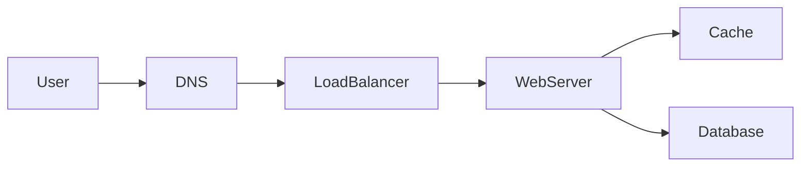

# Caching

## Learning Objectives

- Place a cache on a path only after a working-set argument.
- Choose aside versus read-through and say how you invalidate.
- Name stampede and stale-read trade-offs.
- Keep user-visible writes honest when a cache sits in front.

## Quote

> Cache is not a database with optimism. It is a bet that yesterday's answer is still good enough for this request.

## Introduction

Caching is the most over-drawn box in interviews. Used well, it is the cheapest scale lever for read-heavy working sets. Used poorly, it is a second source of truth you cannot explain. This chapter is when the box earns its keep.

## Core Concepts

**Where it lives:** client, CDN, application, datastore. Closer to the user is faster and harder to invalidate.

**What you store:** the object the hot path needs, not the event stream you will analyze later.

**Aside vs read-through:** aside keeps the app in control; read-through hides load in the cache layer. Both still need a TTL or an explicit invalidation story.

**Stampede:** many misses at once after expiry. Mitigate with jittered TTLs, locking, or serving stale while you refresh.

## Architecture Diagram

*Figure 6.1 — The cache sits on the read path. Writes still land on the database; then you invalidate or overwrite the key. Do not draw arrows that imply the cache is durable.*

## Real-world Example

Redirect lookups for short links: tiny keys, tiny values, brutal read/write skew. Cache the mapping. Do not cache the click counter in the same way if you need approximate-but-durable analytics; send clicks async.

## Enterprise Insight

Enterprises already have a CDN and often a shared Redis platform. Use them, but **do not share a cache cluster between unrelated domains** without key prefixes and memory budgets. A noisy neighbor eviction is an availability incident. Data classification matters: putting session tokens and public catalog pages in the same store without TTL policy will fail a security review.

## Interviewer's Mind

They want the sentence: "working set fits; TTL is N; stale is acceptable because…" They will poke invalidation. "Delete on write" plus TTL is enough for most 45-minute designs. Do not invent a research-grade coherence protocol unless they ask.

## AI Perspective

Prompt caches and embedding caches are still caches: they trade freshness of context for latency and cost. A stale embedding after a document update is a correctness bug in search, not a minor miss. Separate "byte cache for the same URL" from "semantic cache for the same question" — the latter can return the wrong user's answer if keys are poorly scoped.

## Common Mistakes

- Caching writes that must be right now.
- No TTL and no invalidation.
- One global key for a personalized page.
- Using the cache as the system of record.

## Best Practices

- Justify with working set and ratio.
- Jitter TTLs.
- Key by the lookup the hot path actually does.
- Measure hit rate; in the interview, name that metric.

## Summary

A cache is a freshness bet on a small, hot working set. Put it on the read path, invalidate on purpose, and never confuse it with durable storage.

## Key Takeaways

- Working set first, Redis second.
- Invalidation is the design.
- Stampede is a load event you can plan for.
- Personalized data needs personalized keys.

## Interview Questions

- When is a CDN enough and an application cache unnecessary?
- How do you avoid a stampede at expiry?
- What do you cache for a URL shortener, and what do you not?

## Further Reading

- Chapter 3 for the numbers that justify the cache.
- Chapter 10 for a worked redirect cache.
- Your CDN dashboard: pick one path with 99% hit rate and one with 20%, and explain the difference in a paragraph.
