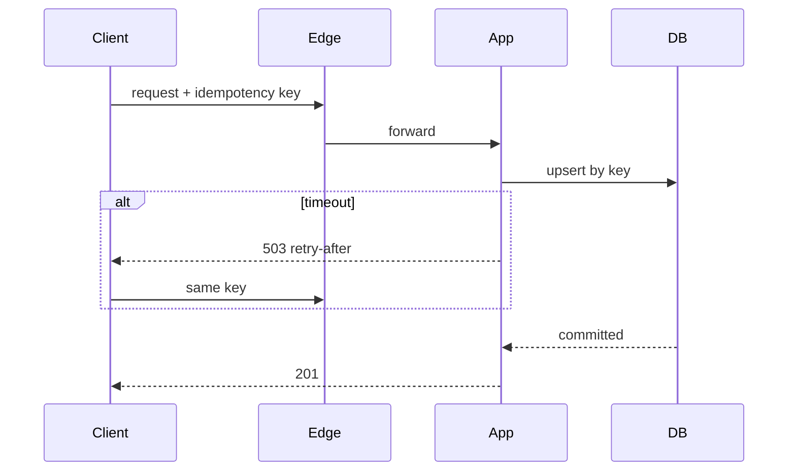

# Reliability

## Learning Objectives

- Define reliability as "correct work over time," distinct from availability.
- Place timeouts, retries, idempotency, and backoff on the path.
- Use health checks that prove work, not only liveness.
- Describe poison messages, at-least-once delivery, and degraded correctness.

## Quote

> Availability is whether the door opens. Reliability is whether the room you entered is the one you were promised.

## Introduction

Chapter 5 asked whether the service is up. This chapter asks whether it **does the right thing** while it is up: no double charges, no dropped messages that the client thought were sent, no retries that amplify an outage. Interviewers use reliability to see if you have been on call.

## Core Concepts

**Reliability** is the probability that a unit of work completes correctly inside its contract. A site can be "available" (HTTP 200) and unreliable (wrong inventory, missing messages).

**Timeouts** bound waiting. **Retries** repeat work. Together they need **idempotency**: the same write twice must not create two orders. **Backoff and jitter** stop retry storms.

**Health:** liveness (process exists) vs readiness (this instance can do work). Load balancers should use readiness.

**Failover is not reliability.** Active-passive (Chapter 5) can still lose the last write if the active dies before the standby has it. That is a **correctness** hole, not an "uptime" hole. Replication lag is a reliability input.

**Poison work:** a payload that always fails. It must dead-letter, not block the queue forever.

## Architecture Diagram

*Figure 6.1 — Reliability is a path with a key, a timeout, and a safe retry. The database enforces "once" for that key.*

## Real-world Example

A payments API returns 504. The client retries and the customer is charged twice because the first write actually landed. Reliability fix: idempotency key from the client, unique constraint, and a timeout shorter than the user's patience. Availability of the API was "mostly up." Reliability of "charge once" was broken.

## Enterprise Insight

Enterprises care about audit: you must show that a retry did not duplicate a legally relevant event. That pushes you toward an outbox and stored idempotency keys with a retention that matches finance, not a 5-minute cache. SLOs for reliability (failed orders, duplicate sends) sit beside availability SLOs. Change management is a reliability input: most incorrect work is a bad deploy, not a cosmic ray.

## Interviewer's Mind

They wait for "idempotency key" on writes and "what if the worker dies after send but before ack." They dislike infinite retries. They like a dead-letter with an owner. Do not say "exactly once" unless you can explain the keys.

## AI Perspective

Model calls fail more often than disk writes. Treat inference as an unreliable dependency: timeout, fallback (cached or template), and never retry a non-idempotent "bill this prompt" without a key. Duplicate completions can leak data or cost; they are a reliability bug, not a quirk of AI.

## Common Mistakes

- Retries without keys.
- Health checks that only ping localhost.
- Equating replication with correctness.
- Swallowing errors to keep availability green.

## Best Practices

- Idempotency on every user-visible write.
- Bounded retries with jitter.
- Readiness vs liveness.
- Dead-letter plus metric.

## Summary

Reliability is correct work under failure. Timeouts, retries, and keys are the mechanism. Availability without reliability is a green dashboard and an angry finance team.

## Key Takeaways

- Up is not correct.
- Retry only what is safe to repeat.
- Health must mean "can do work."
- Poison messages need an exit.

## Interview Questions

- How do you make "send message" safe to retry?
- What does a 200 with the wrong body do to your SLO?
- When should a limiter fail open versus fail closed (reliability vs availability)?

## Further Reading

- Chapter 5 for the availability pairing.
- Chapter 13 for at-least-once consumers.
- Chapter 8 for when retries conflict with consistency.
- Failover data-loss as a reliability topic in community availability notes — describe it on your own path.
