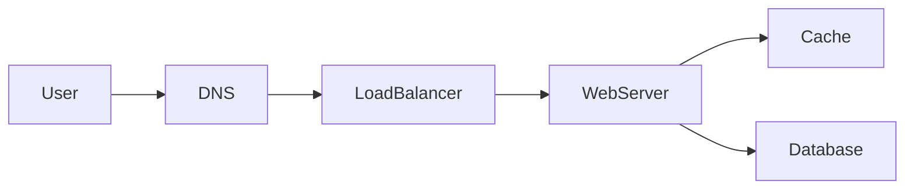
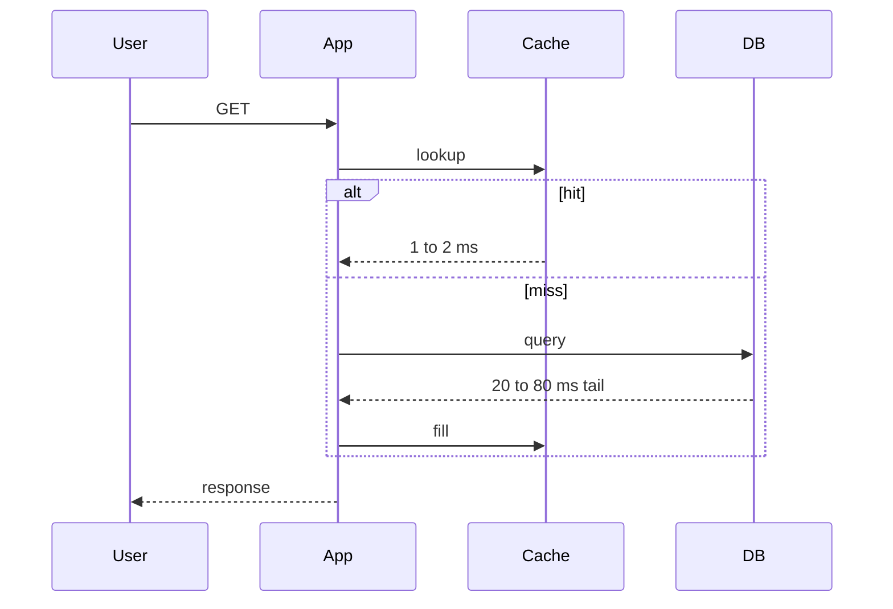

# Performance

## Learning Objectives

- Set latency as a percentile SLO (p50/p99), not "fast."
- Separate latency, throughput, and utilization.
- Find the hop that dominates p99.
- Use queues and caches as performance tools only with a stated cost to freshness.

## Quote

> Average latency is a compliment you pay yourself. Users live in the tail.

## Introduction

Performance in interviews is not micro-benchmarks. It is whether the verb from Chapter 2 completes inside a budget derived from Chapter 3. p99 is where locks, GC, cold caches, and noisy neighbors show up. This chapter is how you talk about speed without turning the board into a profiler.

## Core Concepts

**Latency** is time for one request. **Throughput** is requests per second. You can have high throughput and terrible tails.

**Percentiles.** p50 is typical. p99 is what you design for if the user is waiting. Tail amplification: one slow dependency in serial ruins p99.

**Budgets.** If the page must be 200 ms, and you have DNS, TLS, app, cache, DB, something gets 10–20 ms. Serial hops add; parallel hops need a join.

**Utilization.** A disk at 90% has ugly tails. Headroom is a performance feature.

## Architecture Diagram

*Figure 7.1 — Budget the path. Cache exists to cut database time on hits; it can hurt p99 on stampedes (Chapter 11).*

*Figure 7.2 — The miss path is the p99 you must name.*

## Real-world Example

Redirect of a short link: budget 50–100 ms p99 worldwide. Most of that is distance, not JSON. A cache of mappings makes the app hop boring. Putting click analytics on the same round-trip makes p99 a function of a warehouse. Performance design is **where you refuse to wait**.

## Enterprise Insight

Enterprises have WAN latency, proxies, and DLP scanners on the path. Your beautiful 20 ms service becomes 200 ms in a branch office. Design p99 for the real client, or offer a regional edge. Capacity and performance reviews often fight: finance wants 90% utilization; tails want 50–70% on stateful stores. Say that trade-off (Chapter 10).

## Interviewer's Mind

They like "p99" and a single bottleneck hop. They dislike "we will optimize later" with no budget. They may ask how you would measure; name a histogram, not an average.

## AI Perspective

Token generation is streaming latency, not a single p99 of a JSON blob. Time-to-first-token and tokens/sec are the metrics. Do not put a 2-second model in front of a 100 ms checkout. Batch and cache embeddings so search p99 is index time, not GPU time.

## Common Mistakes

- Optimizing averages.
- Adding hops to "help performance."
- No budget before a cache.
- Synchronous fan-out to many services on the user path.

## Best Practices

- Write p99 on the board.
- Count serial hops.
- Keep the hot path short; async the rest.
- Leave headroom on stateful tiers.

## Summary

Performance is a percentile budget on a named path. Throughput and utilization are cousins. The miss path and the slowest serial dependency own the tail.

## Key Takeaways

- Users live in p99.
- Latency and throughput are not the same knob.
- Every extra hop is a bet against the tail.
- Headroom is part of the design.

## Interview Questions

- Why can p99 get worse when you add a cache?
- How do you budget a 200 ms page with three serial dependencies?
- What utilization would you refuse on a primary database?

## Further Reading

- Chapter 3 for QPS and payload (throughput cousins).
- Chapter 11 for cache tails.
- Chapter 10 for performance versus cost.
