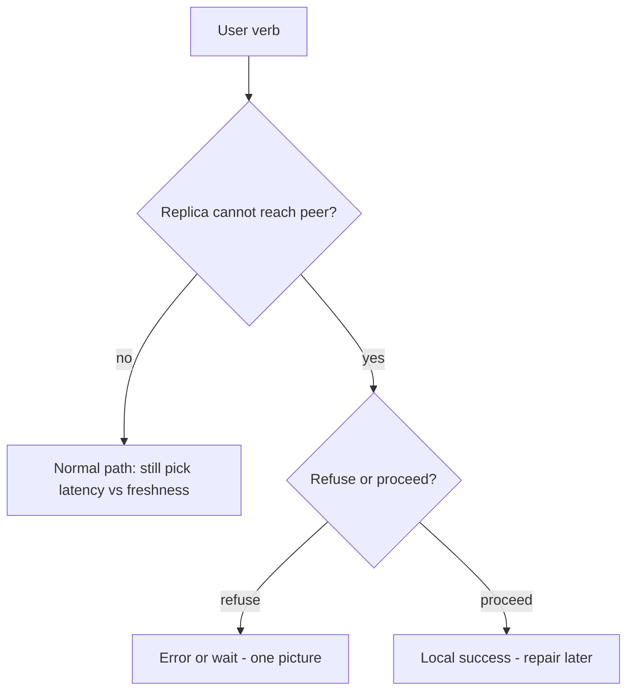

# CAP theorem

## Learning Objectives

- State CAP in operational language: when a partition happens, you choose consistency or availability for that decision.
- Stop using CAP as a product label ("we are CP").
- Tie the choice to a user verb from Chapter 2.
- Know what CAP does *not* say (latency, PACELC, "2 of 3 in normal times").

## Quote

> CAP is not a personality type for your database. It is a fork in the road when the network lies to you.

## Introduction

CAP shows up in interviews as a trap: candidates recite "consistency, availability, partition tolerance — pick two" and then pick a vendor. Architects use a narrower statement: **if the network between replicas is broken, do you refuse the write (preserve a single picture of the data) or accept the write (stay up, risk divergence)?** Partition tolerance is not optional in a distributed system; the interesting choice is the other axis.

This chapter gives you language that survives a follow-up. Chapter 9 names the consistency models you actually ship. Chapter 10 turns the fork into a trade-off sentence.

## Core Concepts

**Partition.** A replica cannot get timely, correct answers from another replica. Timeouts are how partitions look in real life.

**CP-style choice (for this decision):** reject or delay the operation until you can agree. The user sees an error or a wait. The data model stays single-copy in intent.

**AP-style choice (for this decision):** proceed with local state. The user sees success. Copies may disagree until repair.

**Interview wording of the three promises** (say them, then apply to a verb):

- **Consistency:** a read returns the latest completed write, or an error.
- **Availability:** a request gets *some* timely answer; it may be stale.
- **Partition tolerance:** the system still attempts to serve when the network between copies is sick.

Networks fail, so you do not get to drop partition tolerance in a distributed design. The software choice is consistency versus availability **for this verb** when a timeout looks like a partition. Waiting on the isolated copy is the CP-shaped move (good when the business needs atomic reads/writes). Serving the local copy and repairing later is the AP-shaped move (good when eventual visibility is allowed).

**What CAP is not.** It is not "we never have latency." PACELC reminds you: even without a partition, you still trade latency vs consistency. It is not "SQL is CP and NoSQL is AP." Those slogans fail in the room.

## Architecture Diagram

*Figure 8.1 — CAP as an operational fork, not a logo on the database cylinder.*

## Real-world Example

Messenger **send** with a requirement "do not lose the message": on partition between the client's home store and a replica, you may still accept the write in the home region and repair (availability of send, delayed global visibility). Messenger **group admin** "only one owner": you may refuse the second promote during a partition. Same product, two forks. The clarifying questions from Chapter 2 told you which verb you are in.

## Enterprise Insight

Enterprises often pick CP on money and identity, AP on telemetry and presence. The network partitions they actually meet are AZ blips, not textbook datacenter splits — timeouts still fire. Multi-region active-active is an AP-shaped offer unless you have a consensus round on the path (and then you bought latency). Legal "one global balance" is a CP demand; product "never show an error" is an AP demand. Name the conflict.

## Interviewer's Mind

They want you to **apply** CAP to a verb, not define it from a slide. Weak: "Cassandra is AP so we are fine." Strong: "During a partition I will still take chat messages in the local region and reconcile; I will not take a duplicate payment." If you say "pick two," they may ask "which two while the network is healthy?" — have the PACELC sentence ready.

## AI Perspective

Feature stores and prompt caches are usually AP-shaped: stale features beat down search. Ledger of token billing is CP-shaped. Do not run billing counters in the same consistency mode as a recommendation cache.

## Common Mistakes

- Labeling a whole company "AP" or "CP."
- Forgetting that partitions look like timeouts.
- Using CAP to avoid drawing a failover.
- Claiming a system is CA in the CAP sense while it is distributed.

## Best Practices

- Name the verb, then the fork.
- Admit PACELC: latency vs consistency in the happy path.
- Do not tattoo CAP on a vendor.
- Connect to Chapter 6: retries during a partition can duplicate AP writes.

## Summary

CAP is the choice you make when replicas cannot agree in time: refuse (one picture) or proceed (stay up, repair). Apply it per operation. Leave slogans off the board.

## Key Takeaways

- Partitions are timeouts between copies.
- Choose per verb, not per resume bullet.
- Healthy-path latency is a different trade-off (PACELC).
- Vendor labels are not a CAP proof.

## Interview Questions

- For a wallet debit, what do you do if the replica in another AZ does not answer in 100 ms?
- How can one product be both CP-like and AP-like?
- What does CAP not tell you about p99 latency?

## Further Reading

- Chapter 9, consistency models you can actually name on the board.
- Chapter 5, availability as the other side of the fork.
- Chapter 10, turning this fork into a spoken trade-off.
