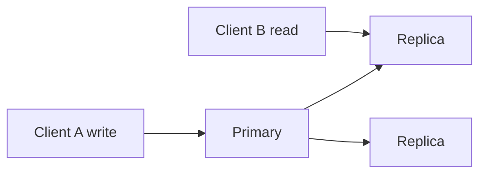
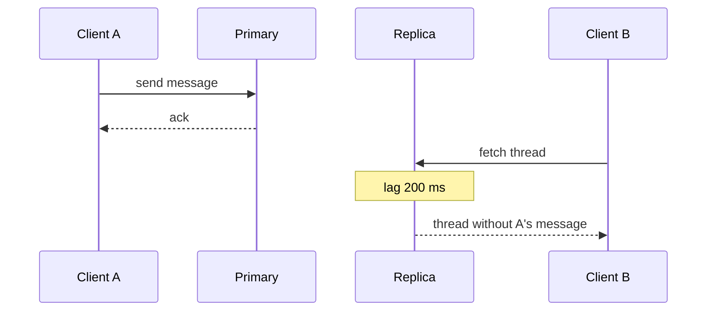

# Consistency models

## Learning Objectives

- Name linearizability, sequential consistency, causal consistency, and eventual consistency in user-visible terms.
- Map read-your-writes, monotonic reads, and bounded staleness to client experience.
- Choose a model for a verb without hiding behind a database logo.
- Connect replica lag to what the user is allowed to see.

## Quote

> Consistency is not a feeling of safety. It is a promise about which writes a read is allowed to miss.

## Introduction

Chapter 8 was the emergency fork. This chapter is the everyday promise: after a write, who sees what, and how soon? Interviewers want words you can test. "Strong" and "weak" are not enough.

You do not need a graduate seminar. You need four or five models and a client-centric checklist.

## Core Concepts

**Linearizability.** There is a single real-time order. After a write completes, every reader sees it. Expensive across regions.

**Sequential consistency.** Operations from each client appear in order, and there is one global order, but it need not match wall-clock. Rarer in interviews; mention only if they push.

**Causal consistency.** If A happened-before B (you saw A, then wrote B), nobody sees B without A. Comment threads care about this.

**Eventual consistency.** If writes stop, replicas converge. In the meantime, reads may be stale. You must say how stale is OK.

**Weak consistency (no promise).** After a write, a read might never see it. Live media and some caches behave this way: if a call drops for two seconds, you do not replay the lost audio. That is not "eventual" — eventual still owes you convergence.

**Informal labels vs this book.** Interviews often use only weak / eventual / strong. Map them so you are not arguing about names:

| Informal label | In this book | Typical verb |
| --- | --- | --- |
| Weak | No promise the write is seen | Presence pulses, live packets |
| Eventual | Converges if writes stop | DNS, like counts |
| Strong | Completed write is visible to later reads | Balances, unique short codes |

"Strong" in that informal cut is closest to synchronous replicate / linearizable reads — still say *which*.

**Client-centric extras:**

- **Read-your-writes:** the writer sees their own write.
- **Monotonic reads:** you do not go backward in time on refresh.
- **Bounded staleness:** "no older than T seconds."

**Read replicas** are a consistency choice: they buy scale (Chapter 4) and spend freshness (Chapter 7 tails and Chapter 8 forks).

## Architecture Diagram

*Figure 9.1 — If Client B hits a replica, the consistency model is "whatever lag you have not described yet." Name it.*

*Figure 9.2 — Eventual / lagged read. If the product needs read-your-writes, A must read P (or a session that waits).*

## Real-world Example

WhatsApp-like 1:1 chat: the sender should read-their-writes on the device that sent (local first). Another device of the same user should catch up without reordering the thread (causal / session). A replica that shows a reply without the original message is a product bug, not a clever AP win. Presence "last seen" can be eventually consistent with seconds of lag. Do not give both verbs the same model.

## Enterprise Insight

Reporting warehouses are eventually consistent by hours. Operational dashboards that drive trading cannot be. Enterprises often accidentally use a replica for a "did the payment succeed?" UI. Call that out. Session stickiness to a primary is an old trick to fake read-your-writes without linearizability across the fleet — and it fights scale. Multi-region "read local" is a consistency product decision sold as a latency win.

## Interviewer's Mind

They like "read-your-writes for the poster; eventual for the like count." They dislike "we are strongly consistent" with a three-region active-active sketch and no consensus round. Ask which client must see the write before you pick the store.

## AI Perspective

RAG indexes are eventually consistent projections of documents. A user who uploaded a PDF and immediately asked a question needs read-your-writes on that document path (wait for index, or search the source). Billing of tokens should not be eventual across the month-end report without a reconciliation job you can name.

## Common Mistakes

- One model for the whole system.
- Ignoring replica lag when you add read replicas.
- Using "eventual" to mean "we did not think."
- Promising linearizability across continents with a straight face and a 50 ms budget.

## Best Practices

- Pick a model per verb.
- If you use replicas, say lag and session behavior.
- Prefer read-your-writes for the user's own writes.
- Convergence is not optional for eventual: name repair (async, anti-entropy, or "last write wins" and its damage).

## Summary

Consistency models are promises about missed writes. Linearizability is the strict real-time promise. Eventual is a lag budget. Causal and session guarantees sit in between and match how humans read threads. Choose per verb.

## Key Takeaways

- "Strong" is not a model.
- Read-your-writes is the most common client need.
- Replicas spend consistency to buy scale.
- Eventual needs a repair story.

## Interview Questions

- How do you give read-your-writes without linearizable global reads?
- What breaks in a comment thread under last-write-wins eventual consistency?
- Why might you refuse a read replica for a balance query?

## Further Reading

- Chapter 8 for the partition fork that makes these models bite.
- Chapter 4 for replicas as a scale lever.
- Chapter 12 for which stores make which promises easier.
