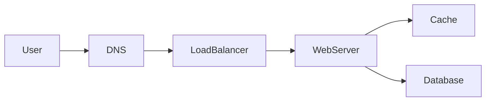
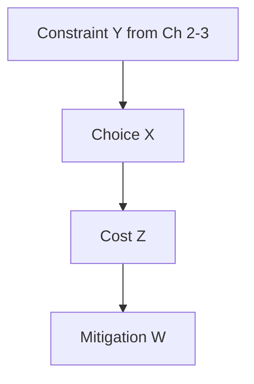

# Architectural trade-offs

## Learning Objectives

- Say a complete trade-off: choose X because of Y; give up Z; mitigate with W.
- Pair the Part I forces: scale, availability, reliability, performance, consistency, cost, operability.
- Avoid false dichotomies and "best practice" with no loser.
- Use the sentence in the interview close.

## Quote

> If you cannot name what you gave up, you did not make a decision. You made a collage.

## Introduction

Part I taught you separate lenses. Real designs smash them together. This chapter is the architect's sentence — the thing interviewers remember — and the end of Foundations. Building blocks in Part II are how you implement a choice you can already say out loud.

## Core Concepts

**The sentence:** "I am choosing X because of constraint Y. The cost is Z. We mitigate with W."

Examples you should be able to produce without a slide:

| Choice | Because | Give up | Mitigate |
| --- | --- | --- | --- |
| Cache mappings | Tiny working set, read skew | Freshness of seconds | TTL plus invalidate on write |
| 302 not 301 | Need to change targets and count clicks | CDN offload of redirects | Cache the mapping, not the 301 |
| Queue clicks | Protect redirect p99 | Immediate exact counts | Approximate + lag metric |
| Read replica | Read QPS | Linearizable reads | Session read-your-writes on primary |
| Fail open on limiter Redis down | Homepage availability | Brief abuse window | Fail closed on payments |
| Single region first | Team of four, latency inside one geography | Disaster story | Document the 10× multi-region hour |
| Larger batches | Throughput of a pipeline | Per-item latency | Cap batch time, flush on size or timer |
| More app clones | Scalability under load | Does not fix single-user slowness | Profile the path first (Ch 4 vs Ch 7) |

Those last two rows are the primer's **latency vs throughput** and **performance vs scalability** pairs. We still add **operability and cost** as first-class axes; a community primer's three pairs are the start of the table, not the end.

**False dichotomies:** SQL vs "NoSQL" as morality; microservices as scale; multi-region as availability. Trade-offs are about **this verb, these numbers, this team**.

**Reversibility.** Prefer the choice you can undo in a quarter. That is an enterprise architect's bias and a valid interview sentence.

## Architecture Diagram

Trade-offs live on the same path; they are labels on arrows, not new products.

*Figure 10.1 — Every extra arrow is a trade-off: cache vs freshness, extra hop vs p99, replica vs consistency. Annotate two of them. That is the chapter.*

*Figure 10.2 — The four-part sentence as a diagram. If W is "hope," the trade-off is unfinished.*

## Real-world Example

WhatsApp-like send path: you choose **store-and-forward in the sender's region first** because offline delivery is a must-have (Chapter 2) and connection RAM is the bottleneck (Chapter 3). You give up immediate global linearizability of the thread (Chapter 9). You mitigate with causal order per conversation and read-your-writes on the sending device. That is a complete trade-off. "We will use a globally distributed strongly consistent store" is not a trade-off; it is a wish that fights Chapter 7.

## Enterprise Insight

In a company the trade-off table has extra columns: vendor lock-in, skill of the owning team, license cost, and control mapping. The "best" consistency model that nobody on the team can operate is a reliability incident (Chapter 6). Architects pick the design the organization can run at 3 a.m. Say that. Interviewers for senior roles are listening for operability as a first-class axis, not an apology.

## Interviewer's Mind

They are waiting for the sentence. If you never give up anything, they will force you: "Your cache is down — now what?" Practice saying Z before they ask. The close (Chapter 17) should repeat one trade-off, not introduce a new one.

## AI Perspective

"Add a model" is a trade-off: quality of ranking versus p99, cost, and privacy. Mitigation: async re-rank, fail open to unranked lists, keep plaintext off the vendor if E2E or residency forbids it. If you cannot name Z, the AI box is decoration.

## Common Mistakes

- "Best of all worlds" diagrams.
- Trade-offs that are just product names.
- Mitigations that are the opposite choice in disguise.
- Changing the trade-off in the last minute.

## Best Practices

- Write Y from requirements and numbers, not from fashion.
- One primary trade-off per deep dive.
- Operability and cost are allowed axes.
- Reversible first.

## Summary

Foundations end when you can choose. The sentence — X because Y, cost Z, mitigate W — is the architect's unit of work. Part II gives you more X's. It does not replace the sentence.

## Key Takeaways

- No loser, no decision.
- Map choices to Part I forces.
- Mitigate; do not deny Z.
- Senior interviews score operability as a trade-off axis.

## Interview Questions

- Give the four-part sentence for adding a cache to redirects.
- What do you give up with read replicas, and how do you mitigate?
- Name a trade-off that is about the team, not the traffic.

## Further Reading

- Chapters 2–9 as the source of Y and Z.
- Chapter 14, where this sentence sits in the interview loop.
- The primer's reminder that **everything is a trade-off** — [system design topics](https://github.com/donnemartin/system-design-primer#system-design-topics-start-here) as a map, not as text.
