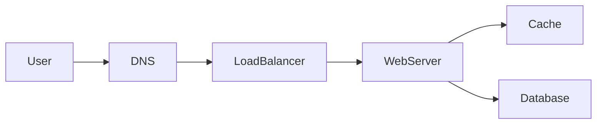

# Data storage

## Learning Objectives

- Choose storage by access pattern and consistency needs, not by fashion.
- Separate the system of record from projections (search, cache, warehouse).
- Explain primary keys, secondary lookups, and why blobs do not belong in the OLTP row.
- Speak replication and partitioning without hiding behind a vendor name.

## Quote

> The database is not "where data goes." It is the component whose consistency model you are actually shipping.

## Introduction

Storage interviews go wrong when the candidate lists five databases to look experienced. You need one system of record per entity, and optional projections that can be rebuilt. This chapter is that discipline.

## Core Concepts

**Access pattern first.** Lookup by primary key, range scan, full-text, time series, and blob download are different jobs. One engine rarely wins all of them.

**System of record vs projection.** Search indexes and warehouses are derived. If they disagree with the record, the record wins unless you explicitly designed a different rule.

**Keys.** The unit of consistency is usually a row or a document with a key. Secondary indexes are not free. Hot partitions follow bad keys.

**Blobs.** Large objects go to object storage; the database keeps the pointer and the metadata.

**Scale levers on a relational record** (when the numbers demand them, Chapter 4):

- **Replication:** extra copies for read scale or failover. Consistency cost is Chapter 9.
- **Federation:** split by function (users DB vs orders DB). Joins across them become your problem.
- **Sharding:** split by a key inside one function. Hot keys remain.
- **Denormalization:** copy fields to avoid joins. Writes must update several places or you accept lag.

SQL versus a specialized store is still access-pattern first, not a fashion choice.

## Architecture Diagram

*Figure 12.1 — Database on the write path; cache in front for hot reads. If you add search or object storage, they branch off this picture as extra stores with a stated role, not as second sources of truth.*

## Real-world Example

Chat messages: the conversation's recent messages are the working set (fast store keyed by conversation ID). Media is object storage plus a metadata row. Search-across-all-history is a projection filled asynchronously. One "chat database" that tries to do all three will satisfy none.

## Enterprise Insight

You will inherit a licensed warehouse, a mandated encryption module, and a backup SLA measured in hours. Design for those. "We'll switch off Postgres" is not an enterprise move in a first interview unless they asked you to greenfield. Do mention: backup/restore drills, encryption keys, and who owns schema change. Multi-region active-active is a product and a legal decision, not a checkbox on a managed database.

## Interviewer's Mind

They like "Postgres is enough" when the numbers say so. They like "this lookup is by short code, so a KV store is justified." They dislike a graph database appearing because the word "relationship" was used once. Ask what queries must be fast before you pick the engine.

## AI Perspective

Vector indexes are projections of embeddings. The document bytes remain in object storage or a document store. Rebuild embeddings when the source changes. Do not put the only copy of a contract inside a vector database. Training data residency is a storage NFR: same questions as any other PII store.

## Common Mistakes

- One store for transactional rows, blobs, and analytics.
- Secondary indexes on write-heavy keys without a plan.
- "We'll use NoSQL for scale" with no access pattern.
- Forgetting restore, not just backup.

## Best Practices

- Name the system of record.
- Put blobs in object storage.
- Match engine to query.
- State replica lag if you read from replicas.

## Summary

Storage follows access pattern and consistency. Keep one record, derive the rest, and keep large bytes out of the transactional row.

## Key Takeaways

- Pattern first, product second.
- Replication, federation, sharding, and denormalization are levers with costs, not decorations.
- Projections can be rebuilt; records cannot.
- Keys drive both correctness and hot spots.
- Object storage for blobs is a default, not a flourish.

## Interview Questions

- When is a relational primary the right call at 10k QPS?
- How do you delete a user across record and projections?
- Why might you refuse a graph database in the first pass?

## Further Reading

- Chapter 4 on partition keys; Chapter 14 when shard owners change with the fleet.
- Chapter 13 on filling projections asynchronously.
- Chapter 9 on which consistency model that store actually offers.
