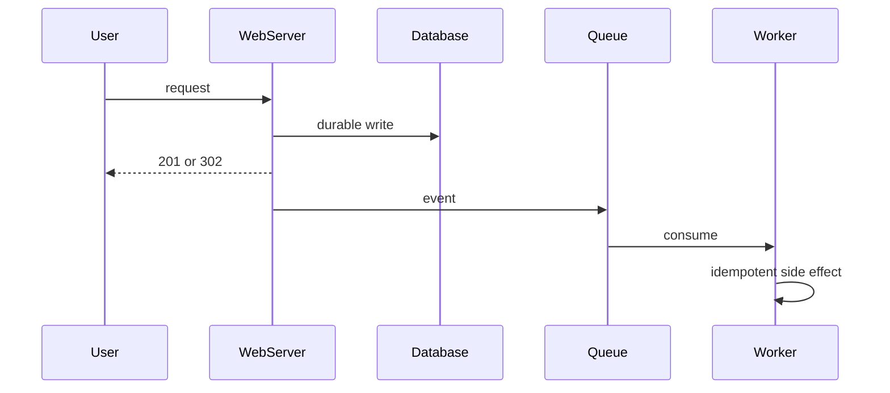

# Messaging and asynchronous work

## Learning Objectives

- Move work off the hot path when the user should not wait.
- Choose queue versus log in first-principles language.
- Design consumers for at-least-once delivery and idempotent writes.
- Apply backpressure instead of unbounded retries.

## Quote

> If the user is not waiting for it, it is a message. If they are waiting for it, it is still a request — even if you put a broker in the middle.

## Introduction

Asynchronous processing is how you protect the latency budget you promised in Chapter 2. Click accounting, thumbnails, emails, search indexing: none of these should sit on the redirect or the checkout round-trip. This chapter is the extra arrow on the diagram — the dashed one.

## Core Concepts

**Queue.** Competing consumers pull work. Good for tasks. Ordering across the whole system is not the point.

**Log.** Consumers keep an offset. Good when multiple independent projections must see the same events.

**Delivery.** At-least-once is the default you should assume. Exactly-once is a marketing phrase unless you designed idempotency and a transactional outbox.

**Backpressure.** If consumers are slow, the buffer grows. Decide: drop, delay the producer, or shed load. Silence is how you discover the incident in billing.

## Architecture Diagram

*Figure 8.1 — User-visible write lands first. The event is after success (or in the same transaction via an outbox). The worker must tolerate duplicates.*

## Real-world Example

Short-link clicks: the user needs a 302. The click is an event. If the analytics store is down, redirects still work. You will replay the queue. Duplicate clicks may over-count unless you key by (code, user, time bucket) or accept approximate counts — say which.

## Enterprise Insight

Enterprises have a mandated broker and a fear of "yet another Kafka." Use the platform bus if it exists; isolate with topics and ownership, not with a shadow cluster you cannot operate. Poison messages need an operator path, not an infinite retry that pages the wrong team. Audit often requires that the event be as trusted as the HTTP log; do not emit events you cannot reconstruct.

## Interviewer's Mind

They want the dashed line and the words "at-least-once" and "idempotent." They will ask what happens if the worker dies after sending the email but before acking. Have that sentence ready. Do not introduce a broker for a 50 QPS CRUD API with no fan-out.

## AI Perspective

Inference batches and embedding jobs are async by default. Queue GPU work; do not hold an HTTP request while a 70B model thinks unless the product is that wait. For user-facing chat with a model, you may stream tokens on a request path instead of a broker — choose on latency, not on fashion.

## Common Mistakes

- Event before durable write (lost intent).
- Assuming ordering across partitions.
- Unbounded queues as "reliability."
- Dual writes to database and broker without an outbox.

## Best Practices

- Write record, then event.
- Idempotency keys on side effects.
- Dead-letter with an owner.
- Metric: lag, not just throughput.

## Summary

Async work is how you keep promises about latency. Assume duplicates, make side effects safe to repeat, and watch lag.

## Key Takeaways

- User wait versus not is the split.
- At-least-once plus idempotency is the default pair.
- Logs and queues solve different fan-out problems.
- Lag is an availability metric for projections.

## Interview Questions

- Why is "exactly once" the wrong first sentence?
- When would you refuse to add a message broker?
- How does an outbox prevent lost events?

## Further Reading

- Chapter 5 for timeouts versus queued work.
- Chapter 15 for click events off the redirect path.
- A consumer you own: list its retry policy and whether it is actually idempotent.
