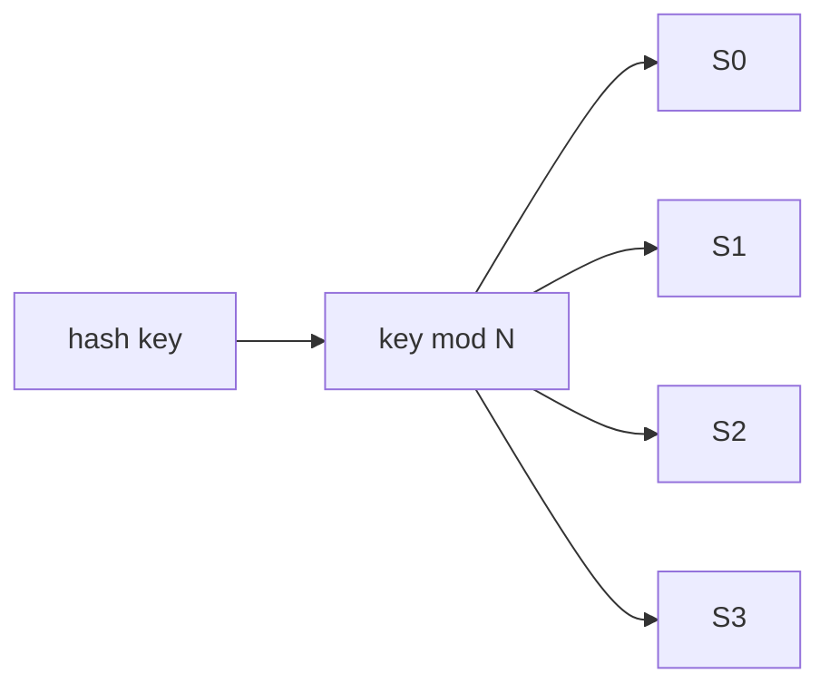
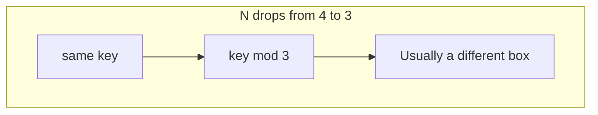
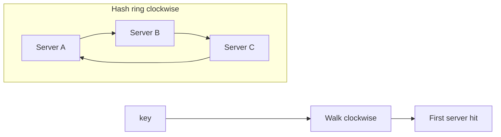
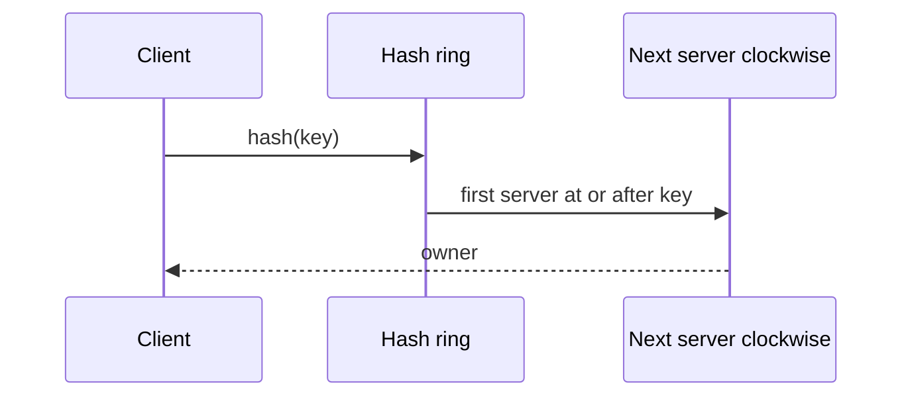
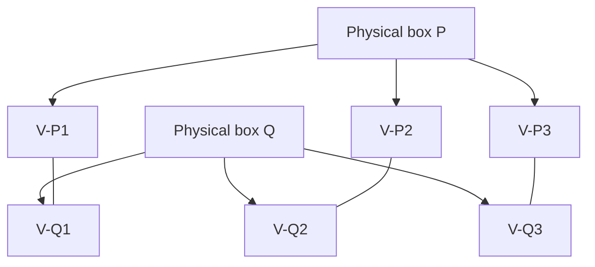

# Consistent hashing

## Learning Objectives

- Explain why `hash(key) % N` causes a miss storm when N changes.
- Place keys and servers on a hash ring and look up clockwise.
- Show that add/remove of a node remaps only nearby keys.
- Use virtual nodes to even out partition sizes.

## Quote

> A partition function that depends on the size of the fleet is a partition function that will lie to you on the worst day of the year.

## Introduction

Horizontal scale (Chapter 4) needs a rule: this key lives on that box. The naive rule is modulo the current server count. It is even when the fleet is frozen. It is a disaster when a box dies, because **almost every key** hashes to a new index. Caches go cold. Databases reshuffle. Consistent hashing is the interview name for a lookup that keeps most keys where they were.

This chapter is that rule, in first principles: a ring, clockwise lookup, virtual nodes. It is how you shard caches, request routers, and some data stores without pretending N is eternal.

## Core Concepts

### The rehashing problem

With N servers, `server = hash(key) % N` is uniform if the hash is. Fetch is cheap. Add or remove one server and N changes, so **the same key** maps to a different remainder. Not only the keys that lived on the dead box move — most keys move. Clients then ask the wrong cache. That is a coordinated miss storm, not a graceful failover.

### Hash space as a ring

Pick a hash with a large output space (think 0 .. 2^160-1 if you name SHA-1 in the room; the exact function matters less than **no modulo by N**). Treat the space as a circle by joining min and max. Map **servers** (by name or IP) onto the circle with the same hash. Map **keys** onto the same circle. To find a key's owner, walk **clockwise** from the key until you hit a server.

### Add and remove

- **Add a server:** it lands between two existing servers. Only keys in the arc that now hits the newcomer move to it. Everyone else stays.
- **Remove a server:** its keys walk clockwise to the next live server. Other arcs are untouched.

On average you remap about k/n keys when one of n slots changes — not k. That is the property you are buying.

### Uneven arcs

Real hashes do not space servers perfectly. One dead neighbor can leave a survivor with an arc twice as wide as its peers. That box then owns too much load.

### Virtual nodes

Give each physical server **many** positions on the ring (virtual nodes), all labeled with the same owner. Arcs become small and mixed. When a machine dies, its virtual nodes' neighbors (often several different machines) absorb the keys. When you add capacity, you sprinkle new virtual nodes instead of one lucky gap. The virtual count is a tuning knob (tens to hundreds per box in production; three is enough to *draw*).

## Architecture Diagram

*Figure 14.1 — Modulo placement. Fine while N is fixed.*

*Figure 14.2 — The rehashing problem: most keys change owner, so caches miss in a storm.*

*Figure 14.3 — Lookup: no modulo by fleet size. Walk the ring until a server.*

*Figure 14.4 — Add a node: only the preceding arc moves. Remove a node: only its arc moves to the next clockwise owner.*

*Figure 14.5 — Virtual nodes: one machine, many ring points, smaller unevenness when someone leaves.*

## Real-world Example

A session cache of eight nodes uses `hash(user) % 8`. One node OOMs at peak. After it is pulled, N=7 and almost every session misses. Login looks like an outage even though seven caches are healthy. Consistent hashing plus virtual nodes would have moved only the dead node's share, spread across several survivors. The product lesson: **cache sharding that depends on N is an availability bug**.

## Enterprise Insight

Platform Redis and Kafka-style partitions already encode this idea (or a relative). Your job in review is to ask: what happens when we add a cache pod at 14:00 on a weekday? If the answer is "we flush everything," you do not have consistent hashing — you have a maintenance window. Also ask who owns the hash library. Two teams with two rings and the same keys will split brains. Sticky sessions at the load balancer are a poor substitute: they fight scale (Chapter 4) and still reshuffle on deploy.

## Interviewer's Mind

They want the modulo storm named **before** the ring. Weak: "we will use consistent hashing" as a product sticker. Strong: draw four boxes, kill one, show which keys move, then add virtual nodes when they ask about imbalance. If they ask about databases, say this is a **placement** function; it does not replace replication or a primary.

## AI Perspective

Embedding indexes and GPU pools also need a placement function. Modulo by replica count will reshuffle vectors on every scale event — expensive re-embeds. Consistent hashing (or a managed shard map) keeps most embeddings put. Do not put the model weights themselves on a key ring unless you enjoy loading 70B parameters because one pod died.

## Common Mistakes

- Modulo by live count in the request path.
- One ring position per fat machine, then wondering why load is skewed.
- Treating the ring as a consistency model.
- Forgetting to rebuild the in-memory ring when membership changes (now you *do* miss).

## Best Practices

- Hash servers and keys with the same function; never `% N` for ownership.
- Clockwise (or consistently counterclockwise) lookup, documented.
- Virtual nodes from day one if boxes are few or unequal.
- Membership change is a control-plane event; measure miss rate around it.

## Summary

`hash % N` is fair until N moves, then it is a miss storm. A hash ring plus clockwise lookup remaps only a neighbor's keys. Virtual nodes keep arcs honest. Use it when you shard caches or request owners across a changing fleet.

## Key Takeaways

- Modulo by fleet size remaps almost everything on add/remove.
- Ring lookup remaps about 1/n of keys.
- Uneven arcs are the remaining problem; virtual nodes shrink them.
- Placement is not durability.

## Interview Questions

- Why do most cache keys miss after one node of a `% N` pool dies?
- Walk a key clockwise onto a four-node ring, then add a fifth. Which keys move?
- What does a virtual node actually store?
- When would you refuse consistent hashing and keep a static map?

## Further Reading

- Chapter 4, the scale lever this placement function serves.
- Chapter 11, why a miss storm is an availability event.
- Chapter 12, sharding keys when the store — not only the cache — must split.
