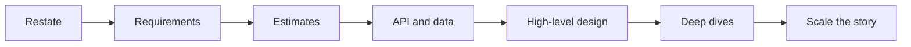
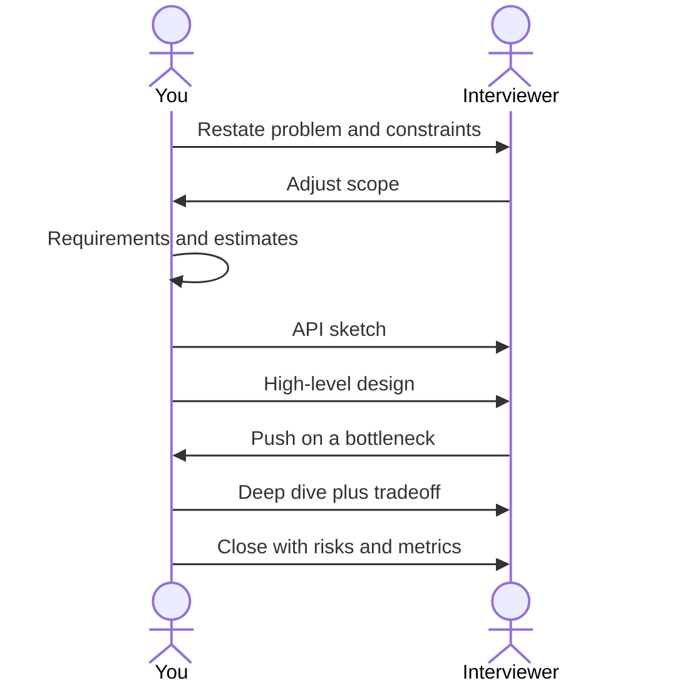

# The interview method

## Learning Objectives

- Run a seven-move loop in 45 minutes without losing the plot.
- Produce four artifacts: scoped problem, justifying numbers, one diagram, one trade-off.
- Use Mermaid for time-ordered behavior and Draw.io for layered architecture.
- Recover when the interviewer steers.

## Quote

> If you get lost, return to the last box you actually completed.

## Introduction

A system design interview is a short, public architecture review. You do not need every pattern in the industry. You need a **loop** you can run when the problem is vague and the clock is not. This chapter is the spine of the book. Parts I and II were fuel. This is the engine.

## Core Concepts

Seven moves:

1. **Restate and bound** — what we are building, who it is for, what we are not building.
2. **Requirements** — functional first, then the NFRs that change the design.
3. **Back-of-the-envelope** — QPS, storage, bandwidth, so the boxes have sizes.
4. **Contracts** — APIs and the core data model.
5. **High-level design** — clients, edge, app, data, async. One picture.
6. **Deep dives** — two or three places the design can fail or get expensive.
7. **Scale the story** — what breaks at 10×, and what you would do next week versus next year.

Time budget (default, not law):

| Minutes | Move | Output on the board |
| --- | --- | --- |
| 0–5 | Restate and bound | Problem sentence + out of scope |
| 5–12 | Requirements | 5–8 bullets, 2–3 NFRs highlighted |
| 12–18 | Estimates | QPS, size of hot data, 1–2 "so we need…" |
| 18–22 | Contracts | 4–6 endpoints or events, 2–3 entities |
| 22–32 | High-level design | One Draw.io-style diagram |
| 32–42 | Deep dives | Bottleneck, consistency, failure |
| 42–45 | Close | Risks, metrics, what more time buys |

A common four-step flow (scope and assumptions → high-level sketch → core components → scale and bottlenecks) is the same conversation compressed. Our seven moves just make estimates and the close first-class. Do not switch templates mid-interview.

## Architecture Diagram

*Figure 15.1 — The interview loop.*

*Figure 15.2 — You lead; they steer.*

When the design has more than three boxes, draw layers. Copy the Draw.io template:

*Figure 15.3 — Default layers: clients, edge, application, data, async. Rename boxes; do not skip a layer without a sentence.*

## Real-world Example

"Design a URL shortener" at speed (full version in Chapter 16): restate create+redirect; park custom domains; NFRs are redirect latency and uniqueness; estimates show read-heavy tiny mappings versus bulky click logs — split the paths; deep dive code generation and cache. If the pretty diagram is incomplete, finish the **redirect sequence**.

## Enterprise Insight

This loop is the same skeleton as an architecture review with extra time removed. In enterprise rooms you add: who operates it, which platform services are mandatory, which control is non-negotiable. In the interview, mention those if they would change a box. Do not perform governance theater.

## Interviewer's Mind

They are scoring whether you can be steered without collapsing. Every interruption is a gift. If they ask about cache stampede, that *is* the deep dive; do not finish your unused talking points first. Weak close: new database in the last ninety seconds. Strong close: two risks, two metrics.

## AI Perspective

Do not use a model in the room as a substitute for the loop. Afterward, ask a model to attack your diagram: missing timeout, missing key, missing degraded mode. In a product that is itself AI, the loop does not change — the model is a dependency with a budget.

## Common Mistakes

- Inventory dump instead of a loop.
- Diagram with no read/write path.
- Skipping estimates, then inventing shards.
- Ignoring the interviewer to "finish the design."

## Best Practices

- Name skipped steps so they know you did not forget.
- Four artifacts or you are not done: scope, numbers, picture, trade-off.
- Draw while talking.
- Park extra features visibly.

## Summary

Run the loop. Leave four artifacts. Let the interviewer choose the deep dive. Close without a new invention.

## Key Takeaways

- Seven moves, one clock.
- Picture plus trade-off beats a catalog.
- Steering is part of the method.
- Stop when the artifacts exist.

## Interview Questions

- What do you drop first if you have fifteen minutes left?
- How do you show you skipped APIs on purpose?
- Which four artifacts should remain if the board is photographed?

## Further Reading

- Appendix A.
- Chapters 2–10 as the fuel for the loop; Chapter 14 when membership of a cache or shard pool changes.
- Chapters 16 and 17 as the first two fully worked problems.
