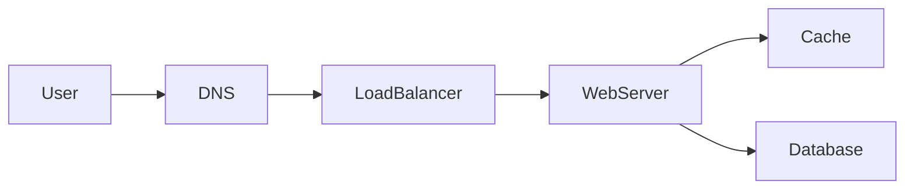
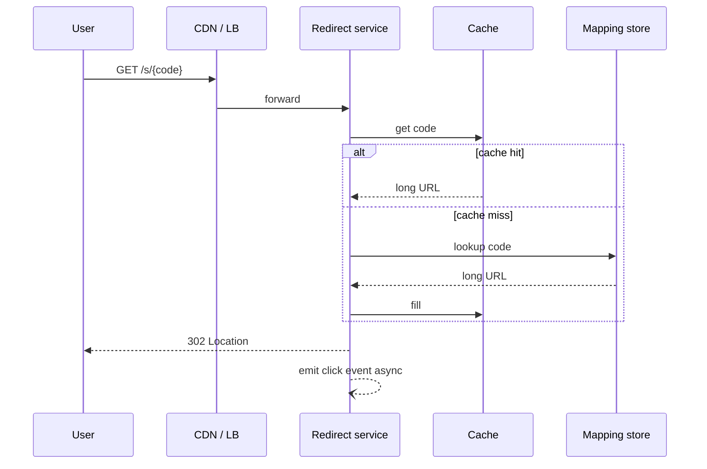

# Problem: URL shortener

## Learning Objectives

- Apply the interview loop to create-and-redirect.
- Split the redirect hot path from click analytics.
- Choose a code-generation approach and name collision behavior.
- Defend cache and 302 versus 301 as trade-offs, not trivia.

## Quote

> The user is waiting on the redirect. Everything else is a dashed line.

## Introduction

This is the first fully worked problem. The product sounds small. It is a clean test of requirements, tiny-but-hot data, and the temptation to overdraw. You will not copy a famous solution. You will run Chapter 14 on a specific verb: turn a long URL into a short one, then send people back.

## Core Concepts

**Functional:** create a short code; redirect; optional click counts.

**Out of scope unless pulled in:** custom domains, QR, campaign suite, SSO.

**NFRs that change the design:** low latency on GET, uniqueness of codes, durability of the mapping, read-heavy ratio.

**Code generation:** counter-plus-encode (simple, needs a uniqueness authority) versus hash-and-truncate (needs collision retry). Say which and why.

**301 vs 302:** 301 lets clients and CDNs cache the destination forever — bad if you need to change targets or count clicks. 302 keeps the control on your servers. Pick 302 unless they want CDN offload of redirects.

## Architecture Diagram

*Figure 10.1 — Redirect read path. The web server here is the redirect service.*

*Figure 10.2 — Happy-path redirect. Analytics must not sit on the latency budget.*

Polished layered view:

*Figure 10.3 — Writes to the mapping service; reads hit cache then store; clicks are asynchronous.*

## Real-world Example

A marketing team wants to change the destination of a printed code after print. That single requirement kills permanent 301 caching at the edge and makes the mapping store the source of truth. Click counts can be approximate; destination changes cannot.

## Enterprise Insight

Enterprises will ask about abuse (open redirector), retention of click logs (PII if you store IPs), and whether the short domain is a brand asset on the corporate DNS. Put rate limits at the edge (Chapter 16). Put logs in a store with a deletion story. Do not run a public shortener without an acceptable-use path; interviewers like that you mentioned it.

## Interviewer's Mind

They expect the cache, the uniqueness story, and the async click. They may push on "what if we have 100× clicks in one country" (edge cache of 302 responses is still risky if destinations change) or "how do you guarantee no collision." Weak: only hashing without retry. Strong: "I will retry on unique-index violation."

## AI Perspective

AI does not belong on this hot path. Where it might appear later: abuse classification of created URLs, run async, with a fail-open redirect if the classifier is down so you do not take the product down to catch phishing late.

## Common Mistakes

- Analytics on the redirect round-trip.
- 301 by default.
- No uniqueness constraint in the store.
- Encoding secrets in the short code and calling it security.

## Best Practices

- Unique index on code.
- Cache mappings, queue clicks.
- 302 until proven otherwise.
- Rate-limit create.

## Summary

A URL shortener is a tiny mapping with a huge read skew. Protect the redirect path, generate unique codes you can defend, and keep scorekeeping off the user wait.

## Key Takeaways

- Mapping is small; click logs are not.
- Uniqueness is a store constraint, not a hope.
- 302 preserves control.
- Dashed line for analytics.

## Interview Questions

- Hash versus counter: what do you give up with each?
- Why might a CDN-cached 301 be a product bug?
- How do you handle a collision on insert?

## Further Reading

- Chapter 11 (cache) and Chapter 13 (click events).
- Chapter 16 if they add "please stop bots creating links."
- Practice prompts of the same family (URL shortening) exist in public primers — solve from this chapter's loop; do not read a sample solution first.
