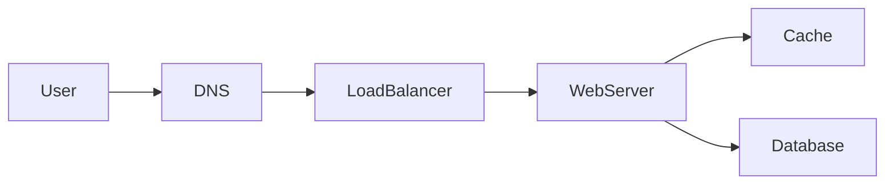

# Problem: Rate limiter

## Learning Objectives

- Place rate limiting at the edge unless an interior limit is required.
- Compare token bucket and sliding window in trade-off language.
- Distribute counters without pretending they are globally exact.
- Return a useful error and a retry signal.

## Quote

> A rate limiter is how you spend availability on purpose so someone else cannot spend it for you.

## Introduction

Rate limiting is a small design with large production consequences. It protects error budgets, unfair noisy neighbors, and cost. Apply the loop: who is limited (IP, user, API key), on which verb, how precise, and where the counter lives.

## Core Concepts

**Token bucket.** Allows bursts; easy to reason about average rate. Good default.

**Sliding window.** Smoother, more storage or more math. Use if they care about burst abuse at window edges.

**Where it lives.** Edge / gateway for public APIs. Library in-process for cheap local limits. Dedicated service when many app instances must share a budget.

**Distributed counters.** Approximate is acceptable for abuse control. Strongly consistent global counts are expensive and become the outage. Shard by key (API token).

## Architecture Diagram

*Figure 11.1 — For many APIs the limiter is a policy on the load balancer or gateway, using the cache as a fast counter store, not the system of record.*

## Real-world Example

The create-short-link API is expensive because of abuse, not because of CPU. Limit by API key at 10/s with a burst of 20. Redirects stay unlimited except for obvious bot nets, handled at the CDN. Different verbs, different budgets.

## Enterprise Insight

Gateways already have rate-limit plugins. Prefer them to a custom service. Enterprises also need *quotas* (monthly) which are billing, not edge milliseconds — those live in a slower store. Distinguish burst control from quota. Legal may require that you do not lock out a hospital's NAT; have a bypass path for blessed keys.

## Interviewer's Mind

They want a 429, a `Retry-After`, and honesty about approximation across instances. They may ask you to draw a limiter service; only do it if local limits cannot share state. Weak: "Redis INCR" with no key and no TTL. Strong: key, TTL, fail policy (fail open vs closed).

## AI Perspective

Model endpoints need tighter, cost-aware limits (tokens per minute, not just requests). Separate the limiter for GPU APIs from the REST CRUD limiter. Fail closed on inference if cost is the risk; fail open on read-only catalog if availability is the risk.

## Common Mistakes

- One global counter for the whole platform.
- Fail closed on the homepage because Redis blinked.
- Precision that requires a transaction per request.
- No distinction between user and IP.

## Best Practices

- Name the key and the budget.
- 429 plus Retry-After.
- Fail open or closed as an explicit NFR.
- Different limits per verb.

## Summary

Rate limiting is a budget with a key, a window, and a place on the path. Approximate distributed counts are fine for abuse. Errors should teach the client when to come back.

## Key Takeaways

- Key, budget, location, fail policy.
- Burst control is not monthly quota.
- Approximation beats a consistent outage.
- Different verbs, different limits.

## Interview Questions

- Token bucket versus sliding window: which burst behavior do you want?
- When must the limiter not share a Redis with the application cache?
- Fail open or fail closed for payments versus marketing pages?

## Further Reading

- Chapter 5 (error budgets).
- Chapter 15 (protect create, not redirect, by default).
- Your gateway's actual rate-limit config, rewritten as a board story.
