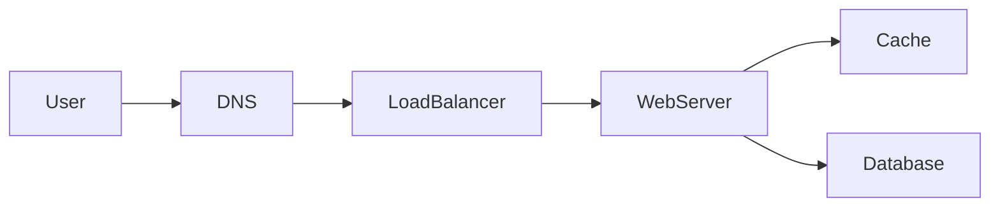
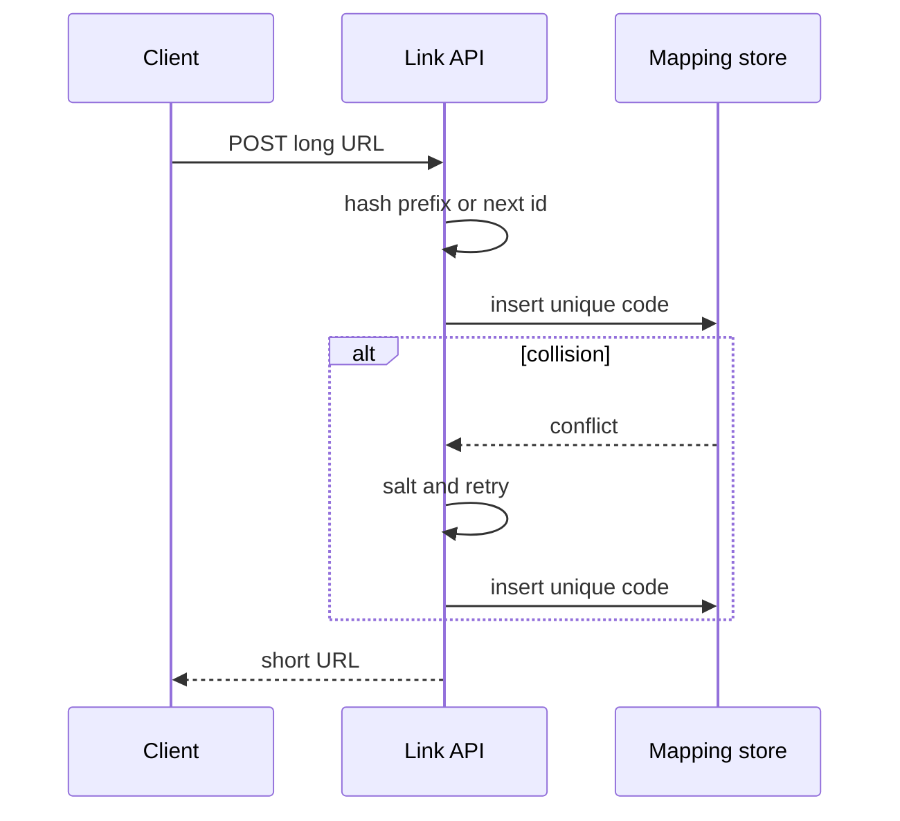
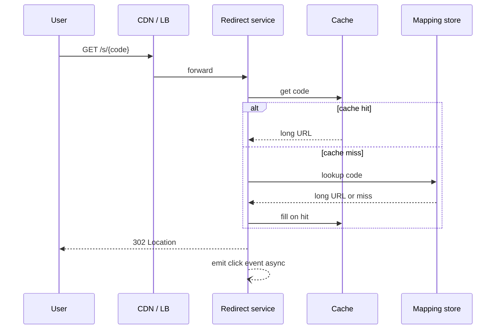

# Problem: URL shortener

## Learning Objectives

- Apply the interview loop to create-and-redirect.
- Split the redirect hot path from click analytics.
- Size a short code (alphabet and length) from capacity, then pick hash-plus-retry or counter-plus-encode.
- Defend cache and 302 versus 301 as trade-offs, not trivia.

## Quote

> The user is waiting on the redirect. Everything else is a dashed line.

## Introduction

This is the first fully worked problem. The product sounds small. It is a clean test of requirements, tiny-but-hot data, and the temptation to overdraw. You will run Chapter 15 on a specific verb: turn a long URL into a short one, then send people back.

## Core Concepts

**Functional:** given a long URL, return a short one; given the short one, send the user to the long one; optional click counts.

**Out of scope unless pulled in:** custom domains, QR, campaign suite, SSO.

**NFRs that change the design:** low latency on GET, uniqueness of codes, durability of the mapping, read-heavy ratio.

### 301 versus 302

**301** says the move is permanent. Browsers and CDNs may never ask you again — good for your CPU, bad if you need to change the target or count clicks. **302** says temporary: every click still visits you. Default to **302** unless they explicitly want edge offload of redirects.

### How long is the code?

Use a 62-character alphabet: `0-9`, `a-z`, `A-Z`. Length n gives 62^n possible codes. Pick the smallest n that clears your Chapter 3 estimate with room for collisions and retired codes. For example, n = 7 is about 3.5×10^12 strings — far above a few hundred billion mappings. Say the estimate **before** you pick seven. Do not recite a magic number.

### Hash then resolve collisions

A cryptographic hash of the long URL is longer than seven characters. Taking a prefix is fine if you **treat collisions as a data problem**: insert with a unique index; on conflict, mix in extra entropy (a counter or a salt) and try again. A bloom filter can skip some disk checks; it is optional polish. The uniqueness constraint is not optional.

### Counter then encode

A monotonic ID encoded in base-62 also works. You need a uniqueness authority (SQL sequence, Snowflake-style ID from Chapter 12's key story). Collisions vanish; IDs leak volume.

## Architecture Diagram

*Figure 16.1 — Redirect read path. The web server here is the redirect service.*

*Figure 16.2 — Shortening. Uniqueness lives in the store, not in hope.*

*Figure 16.3 — Happy-path redirect. Unknown codes 404. Analytics must not sit on the latency budget.*

Polished layered view:

*Figure 16.4 — Writes to the mapping service; reads hit cache then store; clicks are asynchronous.*

## Real-world Example

A marketing team wants to change the destination of a printed code after print. That single requirement kills permanent 301 caching at the edge and makes the mapping store the source of truth. Click counts can be approximate; destination changes cannot.

## Enterprise Insight

Enterprises will ask about abuse (open redirector), retention of click logs (PII if you store IPs), and whether the short domain is a brand asset on the corporate DNS. Put rate limits at the edge (Chapter 17). Put logs in a store with a deletion story. Do not run a public shortener without an acceptable-use path; interviewers like that you mentioned it. If you shard mappings, place them with consistent hashing (Chapter 14) or a static range — do not `% N` the code.

## Interviewer's Mind

They expect the cache, the uniqueness story, and the async click. They may push on "what if we have 100× clicks in one country" (edge cache of 302 responses is still risky if destinations change) or "how do you guarantee no collision." Weak: only hashing without retry. Strong: "I will retry on unique-index violation." They may ask 301 vs 302 to see if you think about analytics versus load.

## AI Perspective

AI does not belong on this hot path. Where it might appear later: abuse classification of created URLs, run async, with a fail-open redirect if the classifier is down so you do not take the product down to catch phishing late.

## Common Mistakes

- Analytics on the redirect round-trip.
- 301 by default.
- No uniqueness constraint in the store.
- Encoding secrets in the short code and calling it security.
- Picking seven characters with no 62^n story.

## Best Practices

- Unique index on code; retry on conflict.
- Cache mappings, queue clicks.
- 302 until proven otherwise.
- Rate-limit create.
- Size n from capacity, not from folklore.

## Summary

A URL shortener is a tiny mapping with a huge read skew. Size the alphabet, enforce uniqueness, protect the redirect path, and keep scorekeeping off the user wait.

## Key Takeaways

- Mapping is small; click logs are not.
- Uniqueness is a store constraint, not a hope.
- 302 preserves control; 301 donates it to the browser.
- Dashed line for analytics.

## Interview Questions

- Hash versus counter: what do you give up with each?
- Why might a CDN-cached 301 be a product bug?
- How do you handle a collision on insert?
- Why 62^7 and not 62^5 for your estimate?

## Further Reading

- Chapter 11 (cache) and Chapter 13 (click events).
- Chapter 14 if mappings must split across boxes.
- Chapter 17 if they add "please stop bots creating links."
