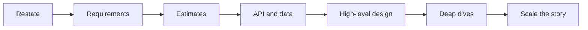

# Closing the interview

## Learning Objectives

- Close in two minutes without a new invention.
- Leave risks, metrics, and a next-hour plan.
- Handle extra time with a planned deep dive, not a new database.
- Turn the session into a photograph the interviewer can replay.

## Quote

> Do not introduce a new database in the last ninety seconds.

## Introduction

Closings are where strong designs become memorable and weak ones leak. You already have the loop. This chapter is the last move: stop designing, start summarizing.

## Core Concepts

**The two-minute close:** restated design in one breath, two risks, two metrics, what another hour would buy.

**Risks** are specific: hot key on `sku_id`, replica lag on read-your-writes, queue lag hiding stale search.

**Metrics** are user-visible plus system: p99 redirect, error rate, cache hit ratio, consumer lag.

**Extra time.** If they offer five minutes, deepen one existing box. Do not add a graph database.

## Architecture Diagram

*Figure 12.1 — The close is G plus a verbal photograph of E and F. You are not starting a new loop.*

## Real-world Example

You designed the shortener. Close: "Create and redirect, 302, unique index, cache mappings, async clicks. Risks: cache stampede on a popular code, collision retries under a naive hasher. Metrics: p99 redirect, unique-violation rate, click-queue lag. With another hour I would design custom domains and abuse classification, not a new store."

## Enterprise Insight

In a real steering committee you close with decision, owner, and review date. In an interview, the analog is: the trade-off you chose, the metric that would prove you wrong, and the reversible next step. Executives remember the last two minutes more than your middle boxes.

## Interviewer's Mind

They are writing feedback now. Help them: repeat the NFR that drove the design. If they are silent, ask "where would you like to go deeper?" That is confidence, not weakness. Do not apologize for the whole design.

## AI Perspective

If you mentioned a model, close with its fail mode: "classifier is async fail-open." If you did not need AI, do not bolt it on in the close to sound modern.

## Common Mistakes

- New components in the close.
- Repeating the whole design at full length.
- No metrics.
- Talking until they cut you off.

## Best Practices

- Timer in your head at minute 42.
- Two risks, two metrics.
- Point at the board; do not orate facing the interviewer only.
- Stop talking when the four sentences are done.

## Summary

The close is a photograph: what you built, what can hurt it, how you would see that, and what time would buy. Then silence.

## Key Takeaways

- Minute 42 is a first-class design step.
- Risks and metrics outlive boxes.
- Extra time deepens, it does not expand.
- No new stores at the end.

## Interview Questions

- What two metrics prove a URL shortener is healthy?
- How do you use leftover time without scope creep?
- What does a bad close sound like?

## Further Reading

- Chapter 14, the loop this close finishes.
- Appendix A, last line.
- After each mock: write your actual closing sentences from memory and edit them.
