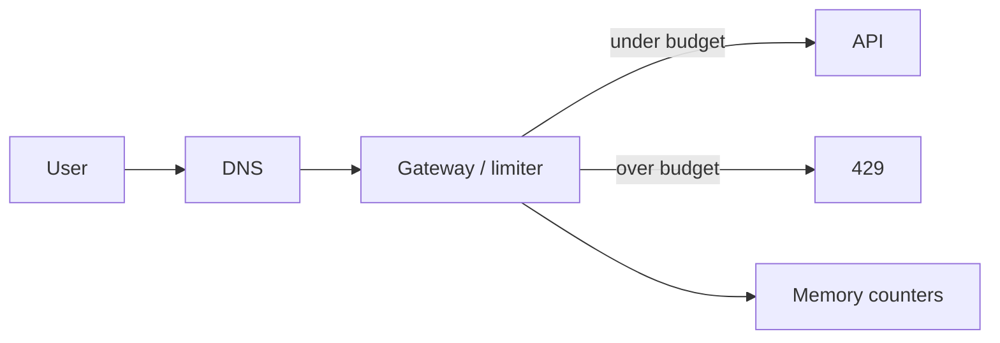
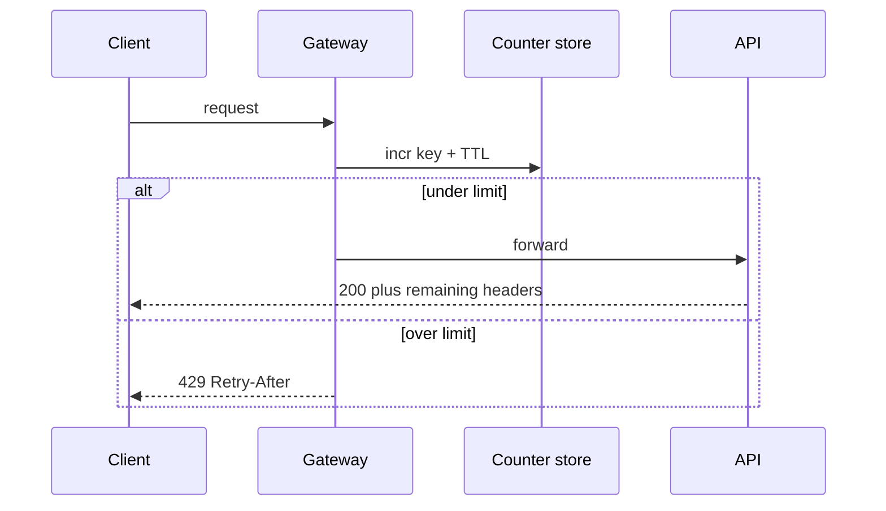
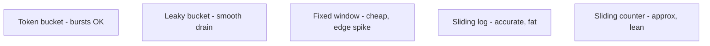

# Problem: Rate limiter

## Learning Objectives

- Place rate limiting at client, server, or gateway and say why the client is not enough.
- Compare token bucket, leaky bucket, fixed window, and sliding windows in trade-off language.
- Store counters in memory with a key and a TTL, not on the disk path.
- Return 429 plus remaining/limit/retry headers, and pick fail-open versus fail-closed.

## Quote

> A rate limiter is how you spend availability on purpose so someone else cannot spend it for you.

## Introduction

Rate limiting is a small design with large production consequences. It protects error budgets, noisy neighbors, and paid downstreams. Apply the loop: who is limited (IP, user, API key), on which verb, how precise, where the counter lives, and what the caller sees when they are over.

## Core Concepts

### Why bother

- Starve less: one client cannot eat the error budget (Chapter 5).
- Cost: third-party APIs billed per call.
- Load: bots and retries should die at the edge, not in the app.

### Where it lives

- **Client:** easily forged; do not trust it as enforcement.
- **Server library:** full control of the algorithm; every language and instance must share state or you under-count.
- **Gateway / middleware:** one choke point, 429 before the app. Prefer this when an API gateway already does TLS and auth.

### Algorithms (pick one and name the loser)

**Token bucket.** Tokens refill at a steady rate up to a cap. A request spends a token. Bursts are allowed until the bucket is empty. Good default for APIs that may spike briefly.

**Leaky bucket.** Queue requests and drain at a fixed rate. Smooth outflow; a burst fills the queue with old work and delays the new.

**Fixed window counter.** Count in wall-clock bins (per second, per minute). Cheap. Two bursts on either side of a boundary can admit almost 2× the budget.

**Sliding window log.** Store timestamps; drop those outside the last T; admit if count < limit. Accurate, memory-heavy (even rejects may leave a stamp).

**Sliding window counter.** Blend this bin and the previous bin by overlap. Approximate, memory-light, good enough for most abuse control.

### Distributed counters

Do not put the counter on a disk database. Use an in-memory store with increment and expire. Key by the limit identity (API key, IP, user). Across app boxes, **approximate** is acceptable for abuse; a linearizable global count is an outage waiting to happen (Chapter 8). Shard the counter key, not the world.

### When they exceed

HTTP **429**. Headers that teach the client: remaining, limit, retry-after. Optionally enqueue (orders) instead of drop — that is a product choice, not a default. If the counter store is down: **fail open** on a brochure page, **fail closed** on payments and GPU (Chapter 7).

## Architecture Diagram

*Figure 17.1 — Limiter in middleware. Counters are fast state, not the system of record.*

*Figure 17.2 — Happy path increments; excess never reaches the app.*

*Figure 17.3 — Algorithm menu. State the burst behavior you want before you name one.*

## Real-world Example

The create-short-link API is expensive because of abuse, not because of CPU. Limit by API key at 10/s with a burst of 20 (token bucket). Redirects stay unlimited except for obvious bot nets, handled at the CDN. Different verbs, different budgets. Rules themselves live in config, cached in the gateway, not hardcoded in every service.

## Enterprise Insight

Gateways already have rate-limit plugins. Prefer them to a custom service. Enterprises also need *quotas* (monthly) which are billing, not edge milliseconds — those live in a slower store. Distinguish burst control from quota. Legal may require that you do not lock out a hospital's NAT; have a bypass path for blessed keys. Monitor false drops: rules that are too tight are a self-inflicted outage.

## Interviewer's Mind

They want a 429, a `Retry-After`, and honesty about approximation across instances. They may walk algorithms until you contrast burst versus smooth. Weak: "Redis INCR" with no key and no TTL. Strong: key, TTL, algorithm, fail policy. They may ask client versus server; say the client is a courtesy.

## AI Perspective

Model endpoints need tighter, cost-aware limits (tokens per minute, not just requests). Separate the limiter for GPU APIs from the REST CRUD limiter. Fail closed on inference if cost is the risk; fail open on read-only catalog if availability is the risk.

## Common Mistakes

- One global counter for the whole platform.
- Fail closed on the homepage because Redis blinked.
- Precision that requires a transaction per request.
- No distinction between user and IP.
- Fixed windows without mentioning the boundary burst.

## Best Practices

- Name the key, the budget, the algorithm, and fail-open/closed.
- 429 plus remaining / limit / retry-after.
- Different limits per verb.
- Watch drop rate; loosen or switch algorithm if you are killing good traffic.

## Summary

Rate limiting is a budget with a key, a window, a place on the path, and an algorithm whose burst behavior you can defend. Approximate distributed counts are fine for abuse. Errors should teach the client when to come back.

## Key Takeaways

- Client limits are not enforcement.
- Token bucket for bursts; leaky for smooth; watch fixed-window edges.
- Counters in memory with TTL.
- 429 is a designed response, not an accident.

## Interview Questions

- Token bucket versus leaky bucket: which burst behavior do you want?
- Why can a fixed one-minute window admit almost twice the quota?
- When must the limiter not share a cache with the application?
- Fail open or fail closed for payments versus marketing pages?

## Further Reading

- Chapter 5 (error budgets and series components: a limiter in series can cost nines).
- Chapter 7 (do not spend GET latency to police create throughput).
- Chapter 16 (protect create, not redirect, by default).
