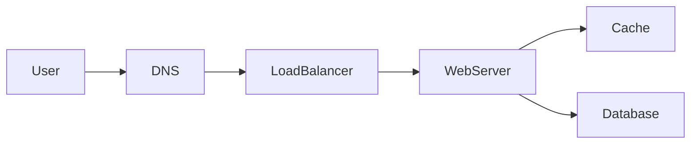

# Chapter title

## Learning Objectives

- 

## Quote

> 

## Introduction

## Core Concepts

## Architecture Diagram

*Figure X.1 — Caption.*

## Real-world Example

## Enterprise Insight

## Interviewer's Mind

## AI Perspective

## Common Mistakes

## Best Practices

## Summary

## Key Takeaways

- 

## Interview Questions

- 

## Further Reading

- 
