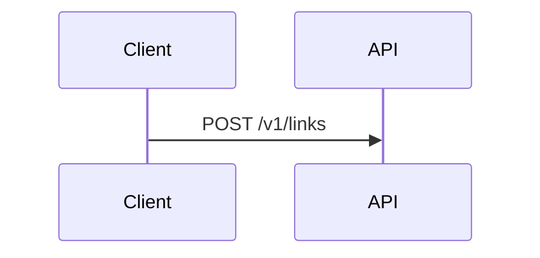

# Authoring guide

This book is written in **Markdown**, versioned in Git, and compiled to EPUB (Kindle and other stores) with Pandoc.

## Daily workflow

1. Edit a chapter under `manuscript/`.
2. Add or update diagrams (Mermaid in the chapter, Draw.io under `diagrams/drawio/`).
3. Preview Markdown in VS Code (Mermaid and Draw.io extensions are recommended).
4. Build locally: `make html` or `make epub`.
5. Commit with a chapter-scoped message, for example `Add capacity estimation worked example to ch04`.

Keep `book.yaml` `status: Writing` until the manuscript is freeze-ready for Version 1.0 copyedit.

## Chapter file rules

- One chapter per file. Do not split a chapter across files.
- First heading in the file is the chapter title (`# Chapter title`).
- Do not put a manual “Chapter N” prefix in the heading; numbering comes from `book.yaml` order.
- Use ATX headings (`#`, `##`, `###`). Kindle handles these reliably.
- Prefer short paragraphs and labeled lists. Avoid HTML except `<br>` when a line break is required in a table.

### Front matter in a chapter (optional)

```markdown
---
slug: the-playbook
status: draft   # draft | review | done
---
```

## Mermaid diagrams

Use Mermaid for **sequence, flow, state, and simple ER** diagrams. Put the code in a fenced block:

````markdown

````

Rules:

- Give every diagram a title in the following paragraph or a bold caption *after* the block: `*Figure 2.1 — Interview loop.*`
- Keep node labels short. Kindle scales diagrams down.
- Do not rely on Mermaid theme colors for meaning; add text labels.
- Standalone sources can also live in `diagrams/mermaid/*.mmd` if you want to reuse a diagram in several chapters. Embed with ``.

The build extracts fenced Mermaid blocks, renders them to SVG, and rewrites the chapter to an image include so EPUB/Kindle do not need a JavaScript renderer.

## Draw.io / diagrams.net

Use Draw.io for **architecture boxes-and-arrows**, multi-layer designs, and anything Mermaid cannot express cleanly.

Preferred file types (commit both when you have them):

| File | Role |
| --- | --- |
| `diagrams/drawio/<name>.drawio` | Editable XML source |
| `diagrams/drawio/<name>.drawio.svg` | Editable *and* a valid SVG for the ebook |

The VS Code extension **Draw.io Integration** (`hediet.vscode-drawio`) opens `.drawio` and `.drawio.svg` in the editor.

Embed the SVG in Markdown with a path relative to the book root:

```markdown


*Figure 11.1 — High-level design for a URL shortener.*
```

If you only have a `.drawio` file, export SVG or PNG from diagrams.net (`File → Export as → SVG`) into the same folder or `diagrams/exported/`. Kindle also accepts PNG; use SVG when labels stay sharp at small sizes.

### Draw.io conventions

- Page size: landscape, content within ~960×540 so it survives phone-width Kindle.
- Font: Sans-serif, ≥14px equivalent.
- One idea per diagram. Split “high-level” vs “data path” vs “failure modes”.
- No screenshot photographs of whiteboards as the source of truth.

## Images other than diagrams

Put photos and cover art in `assets/`. Use PNG or JPEG, RGB, reasonable width (1200–1600 px for full-page figures).

## Code samples

Use fenced blocks with a language tag. Keep samples short. Kindle is a poor IDE.

## What not to put in Git

- Kindle Previewer `.kpf` / `.mobi` binaries
- `_build/` outputs (regenerate with `make`)
- Large unexported `.png` dumps of the same diagram already stored as `.drawio.svg`

## Versioning

- `book.yaml` `version` is the *edition* readers will see (now `1.0`).
- Git tags: `playbook-v1.0.0-manuscript`, then `playbook-v1.0.0` at store upload.
- One logical change per commit. Do not rewrite published chapter history on `main` after freeze; use errata commits.
