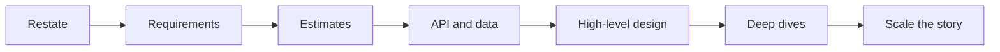
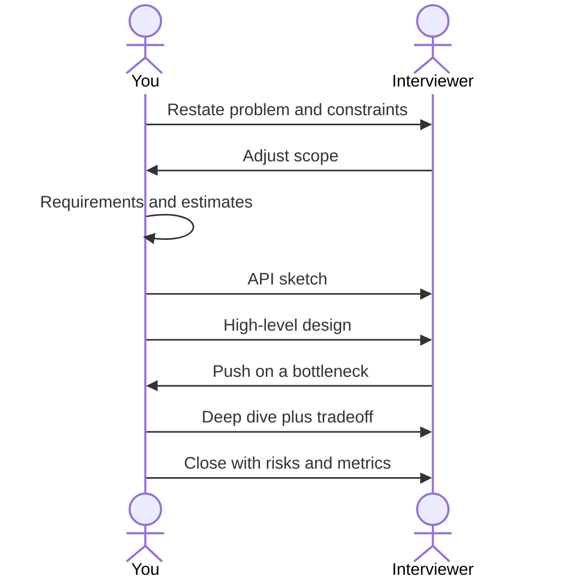
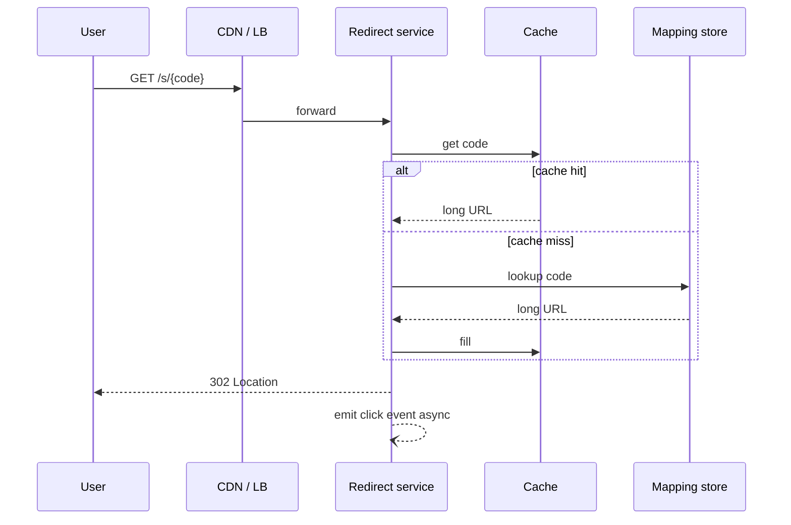

# The playbook

A system design interview is a short, public architecture review. You do not need every pattern in the industry. You need a **loop** you can run when the problem is vague and the clock is not.

This chapter is the spine of the book. Later chapters hang off these seven moves.

## The seven moves

1. **Restate and bound** — what we are building, who it is for, what we are not building.
2. **Requirements** — functional first, then the non-functionals that change the design.
3. **Back-of-the-envelope** — QPS, storage, bandwidth, so the boxes have sizes.
4. **Contracts** — APIs and the core data model.
5. **High-level design** — clients, edge, app, data, async. One picture.
6. **Deep dives** — two or three places the design can fail or get expensive.
7. **Scale the story** — what breaks at 10×, and what you would do next week vs next year.

*Figure 2.1 — The interview loop. If you get lost, return to the last box you actually completed.*

## Time budget (45 minutes)

Treat this as a default, not a law. Interviewers who care about storage will steal time from the API. You still name the skipped step so they know you did not forget it.

| Minutes | Move | Output on the board |
| --- | --- | --- |
| 0–5 | Restate and bound | Problem sentence + out of scope |
| 5–12 | Requirements | 5–8 bullets, 2–3 NFRs highlighted |
| 12–18 | Estimates | QPS, size of hot data, 1–2 “so we need…” |
| 18–22 | Contracts | 4–6 endpoints or events, 2–3 entities |
| 22–32 | High-level design | One Draw.io-style diagram |
| 32–42 | Deep dives | Bottleneck, consistency, failure |
| 42–45 | Close | Risks, metrics, what you would do with more time |

*Figure 2.2 — You lead; they steer. Every arrow back from the interviewer is a gift, not an interruption.*

## High-level design is a picture, not a paragraph

When the design has more than three boxes, **draw it**. This manuscript uses Draw.io for that picture so the same file can be edited in Git and exported into Kindle.

A starter template lives at `diagrams/drawio/playbook-high-level-template.drawio.svg`. Copy it per problem.

*Figure 2.3 — Default layers: clients, edge, application, data, async. Rename boxes; do not skip a layer without a sentence.*

## A worked micro-example: “Design a URL shortener”

You will do this problem fully in Chapter 11. Here it exists only to show the loop at speed.

**Restate.** Create short links that redirect to long URLs, with basic analytics, for a consumer product.

**Out of scope (unless they pull you in).** Custom domains, QR codes, a marketing suite.

**NFRs that matter.** Low latency on redirect (p99), extremely high read/write skew toward reads, uniqueness of short codes, durability of the mapping.

**Estimate sketch.** If 100 million new URLs/month and 100:1 read/write, redirects dominate. The mapping table is small; the log of clicks is not. That single sentence already tells you to **split redirect path from analytics path**.

**Deep dive you should expect.** Code generation (hash vs counter), 301 vs 302, cache on the redirect path, what happens when a key collides.

If you cannot finish the pretty diagram, finish the **redirect data path** in sequence form:

*Figure 2.4 — Happy-path redirect. Analytics is an arrow that must not sit on the user-visible latency budget.*

## What “good” looks like

A strong loop produces four artifacts, even if the boxes are ugly:

1. A scoped problem statement the interviewer agreed to.
2. Two or three numbers that justified a component (cache, queue, shard).
3. One diagram with a labeled read path and write path.
4. One explicit tradeoff (“we choose X because Y; we give up Z”).

Everything else is optional polish. The rest of Part I fills in requirements, estimates, and contracts so the loop is not empty ritual.
